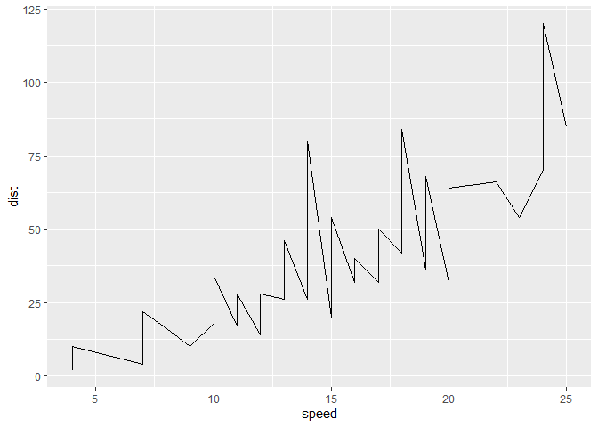
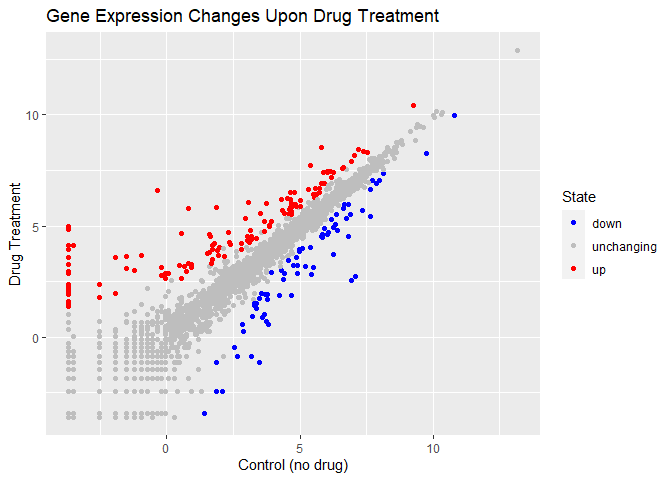
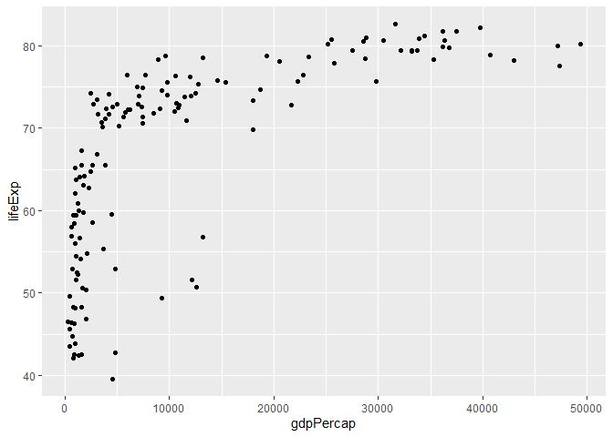
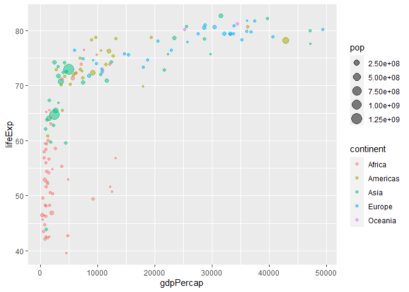
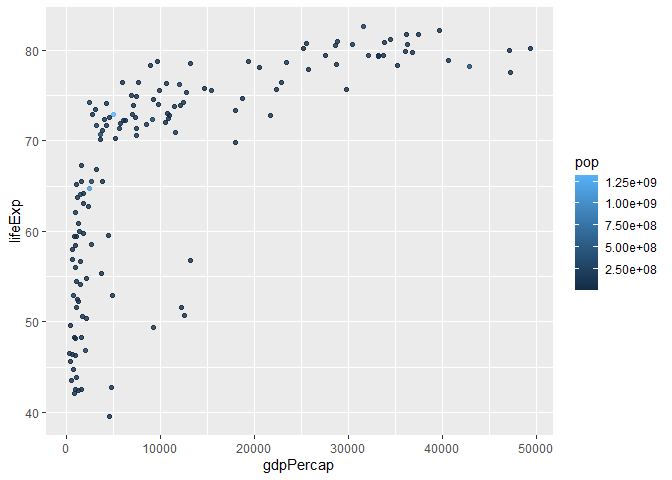
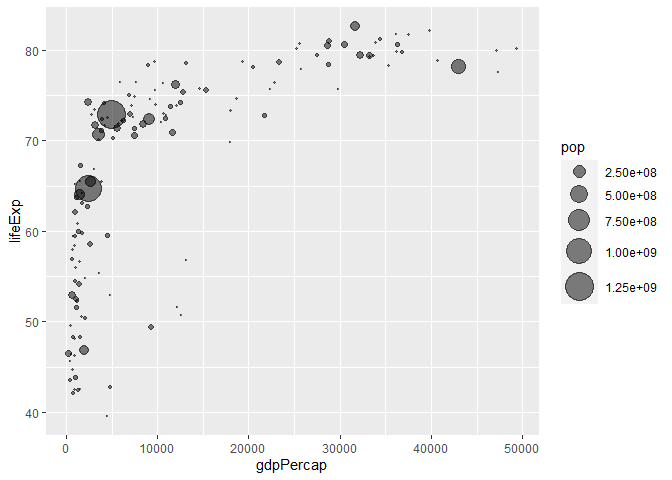
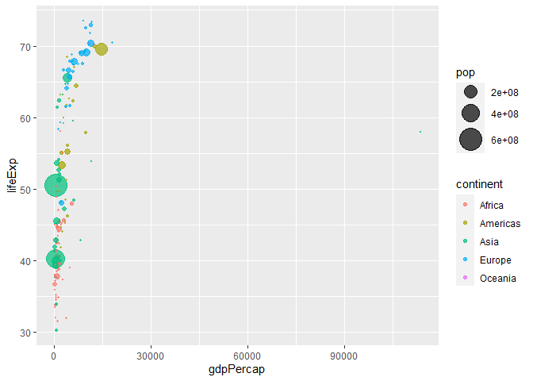
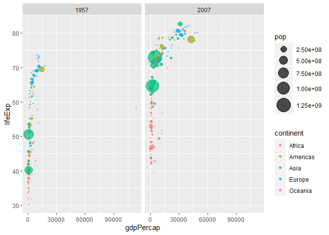

Class 5: Data Visualization
================
Dennis Kim

# Plotting in R

R has multiple plotting and graphics systems. The most popular of which
is **ggplot2**.

We have already played with “base” R graphics. This comes along with R
“out of the box”.

``` r
plot(cars)
```


Compared to base R plots ggplot is much more verbose - I need to write
more code to get simple plots like the one above.

To use ggplot I need to first install the ggplot2 package. To install
any package in R I use the `install.packages()` command along with the
package name.

The install is a one time only requirement. The package is now on our
computer. I don’t need to re-install it.

However, I can’t just use it without loading it up with a `library()`
call.

``` r
library(ggplot2)
```

``` r
ggplot(cars)
```


All ggplot figures need at least 3 things:

- data (this is the data.frame with our numbers)
- aesthetics (“aes”, how our data maps to the plot)
- geoms (do want lines, points, columns, etc…)

``` r
bb <- ggplot(cars)+
  aes(x=speed, y=dist)+
  geom_point()
bb
```


I want a trend line to show the relationship between speed and stopping
distance…

``` r
ggplot(cars)+
  aes(x=speed, y=dist)+
  geom_line()
```



That is not what we want

``` r
bb+geom_smooth()
```

    `geom_smooth()` using method = 'loess' and formula = 'y ~ x'


``` r
bb+
  geom_smooth(method="lm", se=FALSE)
```

    `geom_smooth()` using formula = 'y ~ x'


text in **bold** and text in *italics* are important

# Gene Expression Example

Open Genes

``` r
url <- "https://bioboot.github.io/bimm143_S20/class-material/up_down_expression.txt"
genes <- read.delim(url)
head(genes)
```

            Gene Condition1 Condition2      State
    1      A4GNT -3.6808610 -3.4401355 unchanging
    2       AAAS  4.5479580  4.3864126 unchanging
    3      AASDH  3.7190695  3.4787276 unchanging
    4       AATF  5.0784720  5.0151916 unchanging
    5       AATK  0.4711421  0.5598642 unchanging
    6 AB015752.4 -3.6808610 -3.5921390 unchanging

Graph

``` r
p <- ggplot(genes)+aes(x=Condition1, y=Condition2, col=State)+geom_point()
p+scale_colour_manual(values=c("blue", "gray", "red")) + labs(title="Gene Expression Changes Upon Drug Treatment", x="Control (no drug)", y="Drug Treatment")
```



# Gapminder Example

Gapminder contains economic and demographic data about various countries
since 1952. To install use the `install.packages("gapminder")` and
access it again with `library(gapminder)` Must also download dplyr,
using `install.packages("dplyr")`, and run with `library(dplyr)`

``` r
library(gapminder)
library(dplyr)
```


    Attaching package: 'dplyr'

    The following objects are masked from 'package:stats':

        filter, lag

    The following objects are masked from 'package:base':

        intersect, setdiff, setequal, union

Set data for 2007 only and then open the plot

``` r
gapminder_2007 <- gapminder %>% filter(year==2007)
ggplot(gapminder_2007) +
  aes(x=gdpPercap, y=lifeExp) +
  geom_point()
```



By mapping the variable “continent” to the aesthetic “color” and the
population pop (in millions) through the argument to aes() we can obtain
a richer plot that includes 4 different variables from the data set:

``` r
ggplot(gapminder_2007) +
  aes(x=gdpPercap, y=lifeExp, color=continent, size=pop) +
  geom_point(alpha=0.5)
```



If we were to color by numeric population

``` r
ggplot(gapminder_2007) + 
  aes(x = gdpPercap, y = lifeExp, color = pop) +
  geom_point(alpha=0.8)
```



But it is not scaled, we want to scale it and reflect the actual
population differences. Code using

``` r
ggplot(gapminder_2007) + 
  geom_point(aes(x = gdpPercap, y = lifeExp,
                 size = pop), alpha=0.5) + 
  scale_size_area(max_size = 10)
```



Now we want to compare 1957 vs 2007 Access 1957 data and plot

``` r
gapminder_1957 <- gapminder %>% filter(year==1957)

ggplot(gapminder_1957) + 
  aes(x = gdpPercap, y = lifeExp, color=continent,
                 size = pop) +
  geom_point(alpha=0.7) + 
  scale_size_area(max_size = 10) 
```



Time to compare 1957 vs 2007 using `facet_wrap(~year)`

``` r
gapminder_1957 <- gapminder %>% filter(year==1957 | year==2007)

ggplot(gapminder_1957) + 
  geom_point(aes(x = gdpPercap, y = lifeExp, color=continent,
                 size = pop), alpha=0.7) + 
  scale_size_area(max_size = 10) +
  facet_wrap(~year)
```



# Bar Charts
