Class07: Machine Learning 1 Lab
================
Dennis Kim

In this class we will explore clustering and dimensionality reduction
methods.

## K-means

Make up some input data where we know what the answer should be.

``` r
tmp <-  c(rnorm(30, -3), rnorm(30,3))
x <- cbind(x = tmp, y = rev(tmp))
head(x)
```

                 x         y
    [1,] -1.955782 2.4085554
    [2,] -2.268349 2.9948464
    [3,] -3.759910 0.5076113
    [4,] -2.966209 3.2732613
    [5,] -4.646669 1.7751040
    [6,] -3.166633 4.0597591

Quick plot of x to see the two groups at (-3,3) and (3,-3)

``` r
plot(x)
```

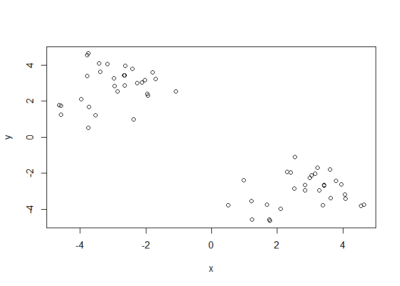

Use the `kmeans()` function setting k to 2 and nstart=20

``` r
km <- kmeans(x, centers=2, nstart=20)
km
```

    K-means clustering with 2 clusters of sizes 30, 30

    Cluster means:
              x         y
    1  2.832327 -2.972654
    2 -2.972654  2.832327

    Clustering vector:
     [1] 2 2 2 2 2 2 2 2 2 2 2 2 2 2 2 2 2 2 2 2 2 2 2 2 2 2 2 2 2 2 1 1 1 1 1 1 1 1
    [39] 1 1 1 1 1 1 1 1 1 1 1 1 1 1 1 1 1 1 1 1 1 1

    Within cluster sum of squares by cluster:
    [1] 57.66925 57.66925
     (between_SS / total_SS =  89.8 %)

    Available components:

    [1] "cluster"      "centers"      "totss"        "withinss"     "tot.withinss"
    [6] "betweenss"    "size"         "iter"         "ifault"      

Inspect/print the results (print km)

> Q. How many points are in each cluster?

``` r
km$size
```

    [1] 30 30

> Q. What component of your result object details - cluster
> assignment/membership - cluster center?

``` r
km$cluster
```

     [1] 2 2 2 2 2 2 2 2 2 2 2 2 2 2 2 2 2 2 2 2 2 2 2 2 2 2 2 2 2 2 1 1 1 1 1 1 1 1
    [39] 1 1 1 1 1 1 1 1 1 1 1 1 1 1 1 1 1 1 1 1 1 1

``` r
km$centers
```

              x         y
    1  2.832327 -2.972654
    2 -2.972654  2.832327

> Q. Plot x colored by the kmeans cluster assignment and add cluster
> centers as blue points

``` r
plot(x, col=km$cluster)
points(km$centers, col="blue", pch=15, cex=2)
```

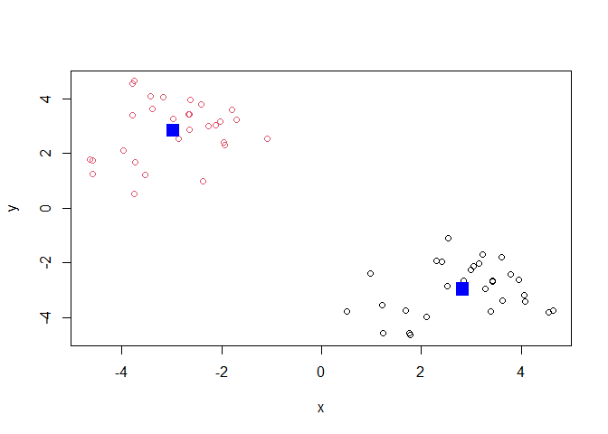

Play with kmeans and ask for a different number of clusters

``` r
km <- kmeans(x, centers=4, nstart=20)
plot(x, col=km$cluster)
points(km$centers, col="blue", pch=15, cex=2)
```

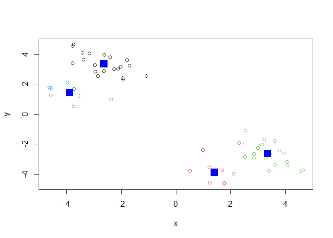

\#Hierarchial Clustering `hcluster()`

This is another very useful and widely employed clustering method which
has the advantage over kmeans in that it can help reveal the something
of the true grouping in your data

The `hclust()` function wants a distance matrix as input. We can get
this from the `dist()` function

``` r
d <- dist(x)
hc <- hclust(d)
hc
```


    Call:
    hclust(d = d)

    Cluster method   : complete 
    Distance         : euclidean 
    Number of objects: 60 

There is a plot method for hclust results:

``` r
plot(hc)
abline(h=10, col="red")
```

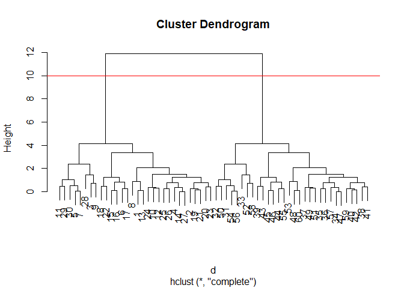

To get my cluster membership vector, I need to “cut” my tree to yield
sub-trees or branches with all the members of a given cluster residing
on the same cut branch. The function is called `cutree()`

``` r
grps <- cutree(hc, h=10)
grps
```

     [1] 1 1 1 1 1 1 1 1 1 1 1 1 1 1 1 1 1 1 1 1 1 1 1 1 1 1 1 1 1 1 2 2 2 2 2 2 2 2
    [39] 2 2 2 2 2 2 2 2 2 2 2 2 2 2 2 2 2 2 2 2 2 2

``` r
plot(x, col=grps)
```

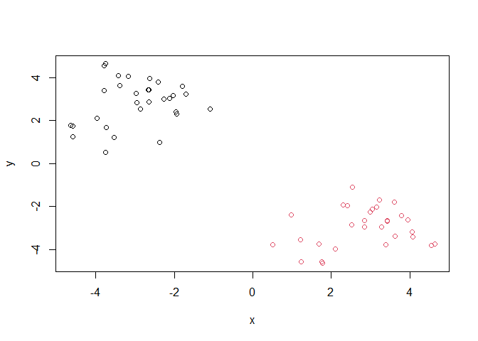

It is often helpful to use the `k=` argument to cutree rather than the
`h=` hieght of cutting with `cutree()`. This will cut the tree to yield
the number of clusters you want

``` r
cutree(hc, k=4)
```

     [1] 1 1 2 1 2 1 2 1 2 1 2 1 1 1 1 1 1 1 1 1 1 1 1 1 1 1 1 2 2 2 3 3 3 4 4 4 4 4
    [39] 4 4 4 4 4 4 4 4 4 4 4 3 4 3 4 3 4 3 4 3 4 4

# Principal Component Analysis (PCA)

The base R function for PCA is called `prcomp()`

\##PCA of UK food import

Access data

``` r
url <- "https://tinyurl.com/UK-foods"
x <- read.csv(url)
```

> Q1 How many rows and columns are there in your new data frame?

``` r
nrow(x)
```

    [1] 17

``` r
ncol(x)
```

    [1] 5

``` r
# or you can do `dim()`
dim(x)
```

    [1] 17  5

There are 17 rows and 5 columns

``` r
head(x)
```

                   X England Wales Scotland N.Ireland
    1         Cheese     105   103      103        66
    2  Carcass_meat      245   227      242       267
    3    Other_meat      685   803      750       586
    4           Fish     147   160      122        93
    5 Fats_and_oils      193   235      184       209
    6         Sugars     156   175      147       139

This gives us a title that we do not want, so we must remove it

``` r
rownames(x) <- x[,1]
x <- x[,-1]
head(x)
```

                   England Wales Scotland N.Ireland
    Cheese             105   103      103        66
    Carcass_meat       245   227      242       267
    Other_meat         685   803      750       586
    Fish               147   160      122        93
    Fats_and_oils      193   235      184       209
    Sugars             156   175      147       139

Run the `dim()` function again

``` r
dim(x)
```

    [1] 17  4

Can alternatively use

``` r
x <- read.csv(url, row.names=1)
head(x)
```

                   England Wales Scotland N.Ireland
    Cheese             105   103      103        66
    Carcass_meat       245   227      242       267
    Other_meat         685   803      750       586
    Fish               147   160      122        93
    Fats_and_oils      193   235      184       209
    Sugars             156   175      147       139

This runs the code by reading the data frame and argues with the data
frame so that the column is run first.

> Q2 Which approach is more preferable

I prefer the second output as it deals with the issue after running the
code once, where as the first method is prone to syntax errors from
accidentally missing commas or brackets.

Spotting major differences and trends. Generate a bar plot

``` r
barplot(as.matrix(x), beside=T, col=rainbow(nrow(x)))
```

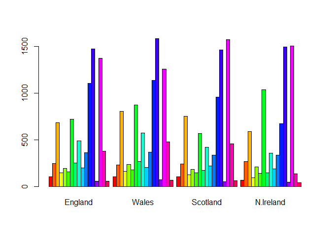

> Q3 Changing what optional arguement will generate a different plot

Changing the beside argument to false change the plot

``` r
barplot(as.matrix(x), beside=F, col=rainbow(nrow(x)))
```

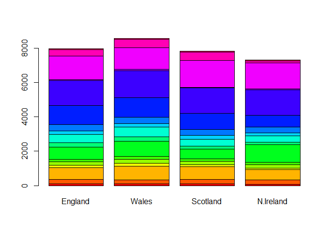

> Q4 There is no Q4 Q5 Can you make sense of the following code and
> resulting figure? What does it mean if a given point lies on the
> diagonal for a given plot?

The points on the plot are the values from the two countries it is
comparing itself with, where one axis will be one country and the other
being the other country. If a point lies on the diagonal, that means it
is correlated with the rest of the points on the diagonal.

``` r
pairs(x, col=rainbow(10), pch=16)
```

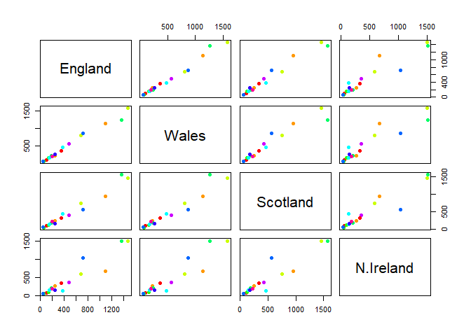

> Q6 What is the main differences between N. Ireland and the other
> countries of the UK in terms of this data-set?

The main difference between N. Ireland and other countries of the UK is
that there are two points that are not aligned with the diagonal.

PCA to the rescue

``` r
# use the `prcomp()` function
pca <- prcomp(t(x))
summary(x)
```

        England           Wales           Scotland        N.Ireland     
     Min.   :  54.0   Min.   :  64.0   Min.   :  53.0   Min.   :  41.0  
     1st Qu.: 156.0   1st Qu.: 175.0   1st Qu.: 147.0   1st Qu.: 135.0  
     Median : 253.0   Median : 265.0   Median : 242.0   Median : 209.0  
     Mean   : 469.6   Mean   : 503.9   Mean   : 460.2   Mean   : 429.9  
     3rd Qu.: 685.0   3rd Qu.: 803.0   3rd Qu.: 566.0   3rd Qu.: 586.0  
     Max.   :1472.0   Max.   :1582.0   Max.   :1572.0   Max.   :1506.0  

A “PCA plot” (a.k.a “Score plot”, PC1 vs PC2 plot, etc.)

``` r
pca$x
```

                     PC1         PC2         PC3           PC4
    England   -144.99315    2.532999 -105.768945  2.842865e-14
    Wales     -240.52915  224.646925   56.475555  7.804382e-13
    Scotland   -91.86934 -286.081786   44.415495 -9.614462e-13
    N.Ireland  477.39164   58.901862    4.877895  1.448078e-13

> Q7 Complete the code below to generate a plot of PC1 vs PC2. The
> second line adds text labels over the data points.

``` r
# Plot PC1 vs PC2
plot(pca$x[,1], pca$x[,2], 
     col=c("orange", "red", "blue", "darkgreen"), pch=15, 
     xlab="PC1", ylab="PC2", xlim=c(-270,500))
text(pca$x[,1], pca$x[,2], colnames(x))
```

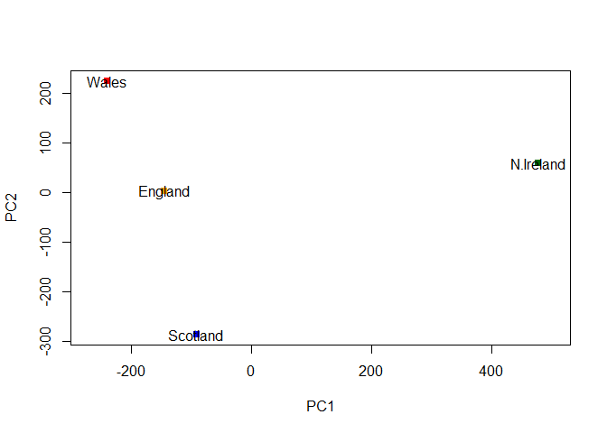

> Q8 Customize your plot so that the colors of the country names match
> the colors in our UK and Ireland map and table at start of this
> document.

``` r
# Plot PC1 vs PC2
plot(pca$x[,1], pca$x[,2], 
     col=c("orange", "red", "blue", "darkgreen"), pch=15, 
     xlab="PC1", ylab="PC2", xlim=c(-270,500))
text(pca$x[,1], pca$x[,2], colnames(x), col=c("orange", "red", "blue", "darkgreen"))
```

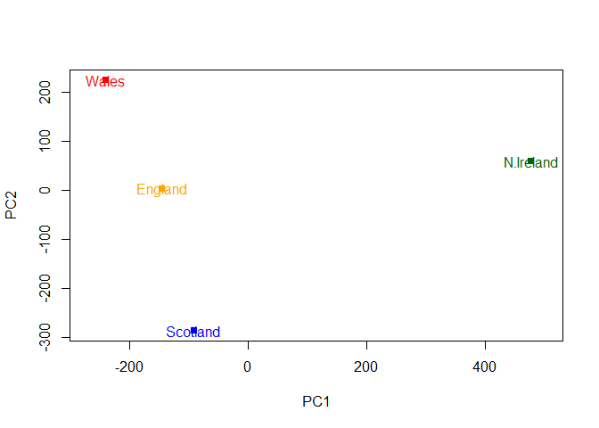

Before we start to use the square of pca\$sdev, which stands for
standard deviation, to calculate how much variation in the original data
each PC accounts for,

``` r
v <- round( pca$sdev^2/sum(pca$sdev^2) * 100 )
v
```

    [1] 67 29  4  0

``` r
## or the second row here...
z <- summary(pca)
z$importance
```

                                 PC1       PC2      PC3          PC4
    Standard deviation     324.15019 212.74780 73.87622 4.188568e-14
    Proportion of Variance   0.67444   0.29052  0.03503 0.000000e+00
    Cumulative Proportion    0.67444   0.96497  1.00000 1.000000e+00

This information can be summarized in a plot of the variances
(eigenvalues) with respect to the principal component number
(eigenvector number), which is given in the next code.

``` r
barplot(v, xlab="Principal Component", ylab="Percent Variation")
```

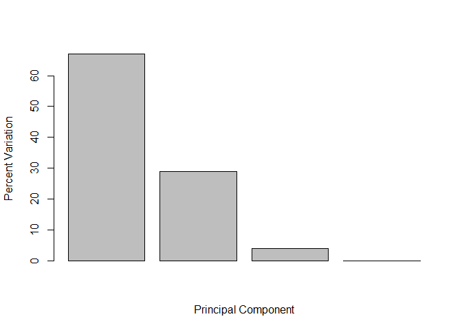

Digging deeper, we can also consider the influence of each of the
original variables upon the principal components (a.k.a loading scores).
The information can be obtained form `prcomp()` and the `$rotation`
component. It can also be summarized to `biplot()`.

``` r
par(mar=c(10, 3, 0.35, 0))
barplot( pca$rotation[,1], las=2 )
```

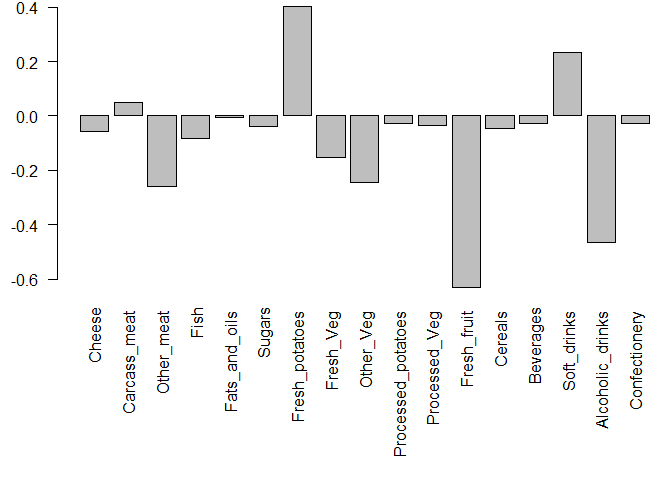

> Q9 Generate a similar ‘loadings plot’ for PC2. What two food groups
> feature prominantely and what does PC2 maninly tell us about?

``` r
par(mar=c(10, 3, 0.35, 0))
barplot( pca$rotation[,2], las=2) 
```

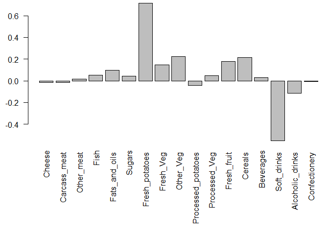

There major shifts are between potatoes and soft drinks
