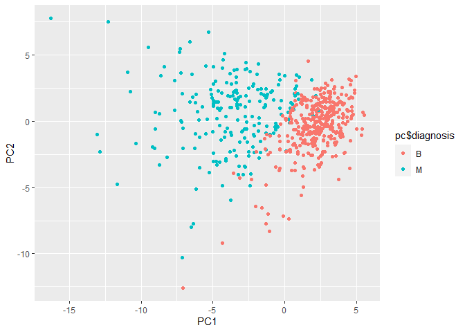
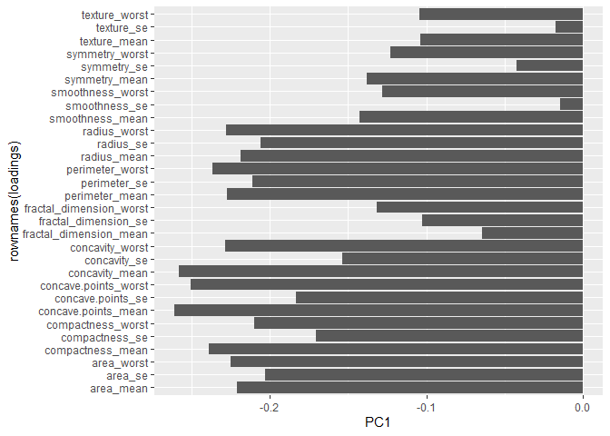

Class08 Mini Project
================
Dennis Kim

## Input the data into our document

``` r
wisc.df <- read.csv("WisconsinCancer.csv", row.names=1)
head(wisc.df)
```

             diagnosis radius_mean texture_mean perimeter_mean area_mean
    842302           M       17.99        10.38         122.80    1001.0
    842517           M       20.57        17.77         132.90    1326.0
    84300903         M       19.69        21.25         130.00    1203.0
    84348301         M       11.42        20.38          77.58     386.1
    84358402         M       20.29        14.34         135.10    1297.0
    843786           M       12.45        15.70          82.57     477.1
             smoothness_mean compactness_mean concavity_mean concave.points_mean
    842302           0.11840          0.27760         0.3001             0.14710
    842517           0.08474          0.07864         0.0869             0.07017
    84300903         0.10960          0.15990         0.1974             0.12790
    84348301         0.14250          0.28390         0.2414             0.10520
    84358402         0.10030          0.13280         0.1980             0.10430
    843786           0.12780          0.17000         0.1578             0.08089
             symmetry_mean fractal_dimension_mean radius_se texture_se perimeter_se
    842302          0.2419                0.07871    1.0950     0.9053        8.589
    842517          0.1812                0.05667    0.5435     0.7339        3.398
    84300903        0.2069                0.05999    0.7456     0.7869        4.585
    84348301        0.2597                0.09744    0.4956     1.1560        3.445
    84358402        0.1809                0.05883    0.7572     0.7813        5.438
    843786          0.2087                0.07613    0.3345     0.8902        2.217
             area_se smoothness_se compactness_se concavity_se concave.points_se
    842302    153.40      0.006399        0.04904      0.05373           0.01587
    842517     74.08      0.005225        0.01308      0.01860           0.01340
    84300903   94.03      0.006150        0.04006      0.03832           0.02058
    84348301   27.23      0.009110        0.07458      0.05661           0.01867
    84358402   94.44      0.011490        0.02461      0.05688           0.01885
    843786     27.19      0.007510        0.03345      0.03672           0.01137
             symmetry_se fractal_dimension_se radius_worst texture_worst
    842302       0.03003             0.006193        25.38         17.33
    842517       0.01389             0.003532        24.99         23.41
    84300903     0.02250             0.004571        23.57         25.53
    84348301     0.05963             0.009208        14.91         26.50
    84358402     0.01756             0.005115        22.54         16.67
    843786       0.02165             0.005082        15.47         23.75
             perimeter_worst area_worst smoothness_worst compactness_worst
    842302            184.60     2019.0           0.1622            0.6656
    842517            158.80     1956.0           0.1238            0.1866
    84300903          152.50     1709.0           0.1444            0.4245
    84348301           98.87      567.7           0.2098            0.8663
    84358402          152.20     1575.0           0.1374            0.2050
    843786            103.40      741.6           0.1791            0.5249
             concavity_worst concave.points_worst symmetry_worst
    842302            0.7119               0.2654         0.4601
    842517            0.2416               0.1860         0.2750
    84300903          0.4504               0.2430         0.3613
    84348301          0.6869               0.2575         0.6638
    84358402          0.4000               0.1625         0.2364
    843786            0.5355               0.1741         0.3985
             fractal_dimension_worst
    842302                   0.11890
    842517                   0.08902
    84300903                 0.08758
    84348301                 0.17300
    84358402                 0.07678
    843786                   0.12440

Wisc.df\$diagnosis is a pathologist provided expert diagnosis, we will
not use this for our unsupervised analysis as it is the “answer” to the
question of which cells are malignant or benign.

To remove this, create a new data frame that omits the first column

``` r
wisc.data <- wisc.df[,-1]
head(wisc.data)
```

             radius_mean texture_mean perimeter_mean area_mean smoothness_mean
    842302         17.99        10.38         122.80    1001.0         0.11840
    842517         20.57        17.77         132.90    1326.0         0.08474
    84300903       19.69        21.25         130.00    1203.0         0.10960
    84348301       11.42        20.38          77.58     386.1         0.14250
    84358402       20.29        14.34         135.10    1297.0         0.10030
    843786         12.45        15.70          82.57     477.1         0.12780
             compactness_mean concavity_mean concave.points_mean symmetry_mean
    842302            0.27760         0.3001             0.14710        0.2419
    842517            0.07864         0.0869             0.07017        0.1812
    84300903          0.15990         0.1974             0.12790        0.2069
    84348301          0.28390         0.2414             0.10520        0.2597
    84358402          0.13280         0.1980             0.10430        0.1809
    843786            0.17000         0.1578             0.08089        0.2087
             fractal_dimension_mean radius_se texture_se perimeter_se area_se
    842302                  0.07871    1.0950     0.9053        8.589  153.40
    842517                  0.05667    0.5435     0.7339        3.398   74.08
    84300903                0.05999    0.7456     0.7869        4.585   94.03
    84348301                0.09744    0.4956     1.1560        3.445   27.23
    84358402                0.05883    0.7572     0.7813        5.438   94.44
    843786                  0.07613    0.3345     0.8902        2.217   27.19
             smoothness_se compactness_se concavity_se concave.points_se
    842302        0.006399        0.04904      0.05373           0.01587
    842517        0.005225        0.01308      0.01860           0.01340
    84300903      0.006150        0.04006      0.03832           0.02058
    84348301      0.009110        0.07458      0.05661           0.01867
    84358402      0.011490        0.02461      0.05688           0.01885
    843786        0.007510        0.03345      0.03672           0.01137
             symmetry_se fractal_dimension_se radius_worst texture_worst
    842302       0.03003             0.006193        25.38         17.33
    842517       0.01389             0.003532        24.99         23.41
    84300903     0.02250             0.004571        23.57         25.53
    84348301     0.05963             0.009208        14.91         26.50
    84358402     0.01756             0.005115        22.54         16.67
    843786       0.02165             0.005082        15.47         23.75
             perimeter_worst area_worst smoothness_worst compactness_worst
    842302            184.60     2019.0           0.1622            0.6656
    842517            158.80     1956.0           0.1238            0.1866
    84300903          152.50     1709.0           0.1444            0.4245
    84348301           98.87      567.7           0.2098            0.8663
    84358402          152.20     1575.0           0.1374            0.2050
    843786            103.40      741.6           0.1791            0.5249
             concavity_worst concave.points_worst symmetry_worst
    842302            0.7119               0.2654         0.4601
    842517            0.2416               0.1860         0.2750
    84300903          0.4504               0.2430         0.3613
    84348301          0.6869               0.2575         0.6638
    84358402          0.4000               0.1625         0.2364
    843786            0.5355               0.1741         0.3985
             fractal_dimension_worst
    842302                   0.11890
    842517                   0.08902
    84300903                 0.08758
    84348301                 0.17300
    84358402                 0.07678
    843786                   0.12440

Create a new separate vector called “diagnosis” that will contain the
data from the diagnosis column of the original data set. We will store
this as a factor (which is useful for plotting) and use this to check
our results.

``` r
diagnosis <- as.factor(wisc.df[,1])
wisc.data <- wisc.df[,-1]
head(wisc.data)
```

             radius_mean texture_mean perimeter_mean area_mean smoothness_mean
    842302         17.99        10.38         122.80    1001.0         0.11840
    842517         20.57        17.77         132.90    1326.0         0.08474
    84300903       19.69        21.25         130.00    1203.0         0.10960
    84348301       11.42        20.38          77.58     386.1         0.14250
    84358402       20.29        14.34         135.10    1297.0         0.10030
    843786         12.45        15.70          82.57     477.1         0.12780
             compactness_mean concavity_mean concave.points_mean symmetry_mean
    842302            0.27760         0.3001             0.14710        0.2419
    842517            0.07864         0.0869             0.07017        0.1812
    84300903          0.15990         0.1974             0.12790        0.2069
    84348301          0.28390         0.2414             0.10520        0.2597
    84358402          0.13280         0.1980             0.10430        0.1809
    843786            0.17000         0.1578             0.08089        0.2087
             fractal_dimension_mean radius_se texture_se perimeter_se area_se
    842302                  0.07871    1.0950     0.9053        8.589  153.40
    842517                  0.05667    0.5435     0.7339        3.398   74.08
    84300903                0.05999    0.7456     0.7869        4.585   94.03
    84348301                0.09744    0.4956     1.1560        3.445   27.23
    84358402                0.05883    0.7572     0.7813        5.438   94.44
    843786                  0.07613    0.3345     0.8902        2.217   27.19
             smoothness_se compactness_se concavity_se concave.points_se
    842302        0.006399        0.04904      0.05373           0.01587
    842517        0.005225        0.01308      0.01860           0.01340
    84300903      0.006150        0.04006      0.03832           0.02058
    84348301      0.009110        0.07458      0.05661           0.01867
    84358402      0.011490        0.02461      0.05688           0.01885
    843786        0.007510        0.03345      0.03672           0.01137
             symmetry_se fractal_dimension_se radius_worst texture_worst
    842302       0.03003             0.006193        25.38         17.33
    842517       0.01389             0.003532        24.99         23.41
    84300903     0.02250             0.004571        23.57         25.53
    84348301     0.05963             0.009208        14.91         26.50
    84358402     0.01756             0.005115        22.54         16.67
    843786       0.02165             0.005082        15.47         23.75
             perimeter_worst area_worst smoothness_worst compactness_worst
    842302            184.60     2019.0           0.1622            0.6656
    842517            158.80     1956.0           0.1238            0.1866
    84300903          152.50     1709.0           0.1444            0.4245
    84348301           98.87      567.7           0.2098            0.8663
    84358402          152.20     1575.0           0.1374            0.2050
    843786            103.40      741.6           0.1791            0.5249
             concavity_worst concave.points_worst symmetry_worst
    842302            0.7119               0.2654         0.4601
    842517            0.2416               0.1860         0.2750
    84300903          0.4504               0.2430         0.3613
    84348301          0.6869               0.2575         0.6638
    84358402          0.4000               0.1625         0.2364
    843786            0.5355               0.1741         0.3985
             fractal_dimension_worst
    842302                   0.11890
    842517                   0.08902
    84300903                 0.08758
    84348301                 0.17300
    84358402                 0.07678
    843786                   0.12440

## Exploratory data analysis

> Q1. How many observations are in this dataset?

``` r
nrow(wisc.data)
```

    [1] 569

There are 569 observations in this set

> Q2. How many of the observations have a malignant diagnosis?

``` r
table(wisc.df$diagnosis)
```


      B   M 
    357 212 

There are 212 malignant diagnosis.

> Q3. How many variables/features in the data are suffized with
> “\_mean”?

First find the column names

``` r
colnames(wisc.data)
```

     [1] "radius_mean"             "texture_mean"           
     [3] "perimeter_mean"          "area_mean"              
     [5] "smoothness_mean"         "compactness_mean"       
     [7] "concavity_mean"          "concave.points_mean"    
     [9] "symmetry_mean"           "fractal_dimension_mean" 
    [11] "radius_se"               "texture_se"             
    [13] "perimeter_se"            "area_se"                
    [15] "smoothness_se"           "compactness_se"         
    [17] "concavity_se"            "concave.points_se"      
    [19] "symmetry_se"             "fractal_dimension_se"   
    [21] "radius_worst"            "texture_worst"          
    [23] "perimeter_worst"         "area_worst"             
    [25] "smoothness_worst"        "compactness_worst"      
    [27] "concavity_worst"         "concave.points_worst"   
    [29] "symmetry_worst"          "fractal_dimension_worst"

Next I need to search within the column names for the suffix “\_mean”
pattern. The `grep()` function might help here.

``` r
#grep("search input", the data to search through)
grep("_mean", colnames(wisc.data))
```

     [1]  1  2  3  4  5  6  7  8  9 10

``` r
#only counts out how many, use `length()` to count it all at once
length(grep("_mean", colnames(wisc.data)))
```

    [1] 10

There are 10 variables that are suffixed “\_mean”

> How many dimensions are in this dataset?

``` r
ncol(wisc.data)
```

    [1] 30

# Performing PCA

Check the column means and standard deviations

``` r
colMeans(wisc.data)
```

                radius_mean            texture_mean          perimeter_mean 
               1.412729e+01            1.928965e+01            9.196903e+01 
                  area_mean         smoothness_mean        compactness_mean 
               6.548891e+02            9.636028e-02            1.043410e-01 
             concavity_mean     concave.points_mean           symmetry_mean 
               8.879932e-02            4.891915e-02            1.811619e-01 
     fractal_dimension_mean               radius_se              texture_se 
               6.279761e-02            4.051721e-01            1.216853e+00 
               perimeter_se                 area_se           smoothness_se 
               2.866059e+00            4.033708e+01            7.040979e-03 
             compactness_se            concavity_se       concave.points_se 
               2.547814e-02            3.189372e-02            1.179614e-02 
                symmetry_se    fractal_dimension_se            radius_worst 
               2.054230e-02            3.794904e-03            1.626919e+01 
              texture_worst         perimeter_worst              area_worst 
               2.567722e+01            1.072612e+02            8.805831e+02 
           smoothness_worst       compactness_worst         concavity_worst 
               1.323686e-01            2.542650e-01            2.721885e-01 
       concave.points_worst          symmetry_worst fractal_dimension_worst 
               1.146062e-01            2.900756e-01            8.394582e-02 

``` r
apply(wisc.data, 2, sd)
```

                radius_mean            texture_mean          perimeter_mean 
               3.524049e+00            4.301036e+00            2.429898e+01 
                  area_mean         smoothness_mean        compactness_mean 
               3.519141e+02            1.406413e-02            5.281276e-02 
             concavity_mean     concave.points_mean           symmetry_mean 
               7.971981e-02            3.880284e-02            2.741428e-02 
     fractal_dimension_mean               radius_se              texture_se 
               7.060363e-03            2.773127e-01            5.516484e-01 
               perimeter_se                 area_se           smoothness_se 
               2.021855e+00            4.549101e+01            3.002518e-03 
             compactness_se            concavity_se       concave.points_se 
               1.790818e-02            3.018606e-02            6.170285e-03 
                symmetry_se    fractal_dimension_se            radius_worst 
               8.266372e-03            2.646071e-03            4.833242e+00 
              texture_worst         perimeter_worst              area_worst 
               6.146258e+00            3.360254e+01            5.693570e+02 
           smoothness_worst       compactness_worst         concavity_worst 
               2.283243e-02            1.573365e-01            2.086243e-01 
       concave.points_worst          symmetry_worst fractal_dimension_worst 
               6.573234e-02            6.186747e-02            1.806127e-02 

Execute PCA with the prcomp() function on the wisc.data, scaling if
appropriate, and assign the output model to wisc.pr.

``` r
wisc.pr <- prcomp(wisc.data, scale=TRUE)
#take note that the measurements are not consistent throughout the data set, set the scale=TRUE to scale it properly so that it is not dominated by one column that is not measured correctly
```

Look at the summary of the results

``` r
summary(wisc.pr)
```

    Importance of components:
                              PC1    PC2     PC3     PC4     PC5     PC6     PC7
    Standard deviation     3.6444 2.3857 1.67867 1.40735 1.28403 1.09880 0.82172
    Proportion of Variance 0.4427 0.1897 0.09393 0.06602 0.05496 0.04025 0.02251
    Cumulative Proportion  0.4427 0.6324 0.72636 0.79239 0.84734 0.88759 0.91010
                               PC8    PC9    PC10   PC11    PC12    PC13    PC14
    Standard deviation     0.69037 0.6457 0.59219 0.5421 0.51104 0.49128 0.39624
    Proportion of Variance 0.01589 0.0139 0.01169 0.0098 0.00871 0.00805 0.00523
    Cumulative Proportion  0.92598 0.9399 0.95157 0.9614 0.97007 0.97812 0.98335
                              PC15    PC16    PC17    PC18    PC19    PC20   PC21
    Standard deviation     0.30681 0.28260 0.24372 0.22939 0.22244 0.17652 0.1731
    Proportion of Variance 0.00314 0.00266 0.00198 0.00175 0.00165 0.00104 0.0010
    Cumulative Proportion  0.98649 0.98915 0.99113 0.99288 0.99453 0.99557 0.9966
                              PC22    PC23   PC24    PC25    PC26    PC27    PC28
    Standard deviation     0.16565 0.15602 0.1344 0.12442 0.09043 0.08307 0.03987
    Proportion of Variance 0.00091 0.00081 0.0006 0.00052 0.00027 0.00023 0.00005
    Cumulative Proportion  0.99749 0.99830 0.9989 0.99942 0.99969 0.99992 0.99997
                              PC29    PC30
    Standard deviation     0.02736 0.01153
    Proportion of Variance 0.00002 0.00000
    Cumulative Proportion  1.00000 1.00000

> Q4. From your results, what proportion of the original variance is
> captured by the first principal components (PC1)?

44.27% was captured

> Q5. How many principal components (PCs) are required to describe at
> least 70% of the original variance in the data?

3 PCs capture over 70% of the original variance (look at the cumulative
proportion)

> Q6. How many principal components (PCs) are required to describe at
> least 90% of the original variance in the data?

7 PCs are required to describe at least 90% of the original variance

> Q7. What stands out to you about this plot? Is it easy or difficult to
> understand? Why?

It is difficult to understand as it overlaps too much and crowds the
plot.

## PC Plot

Time to create our own plot of PC1 vs PC2 (a.k.a score plot, PC-plot,
etc.) The main result of PCA…

``` r
# Scatter plot observations by components 1 and 2
plot( wisc.pr$x[,1], wisc.pr$x[,2],
     xlab = "PC1", ylab = "PC2", col=diagnosis)
```


Can also run in ggplot2

``` r
library(ggplot2)

pc <- as.data.frame(wisc.pr$x)
pc$diagnosis <- diagnosis

ggplot(pc, aes(PC1, PC2, col=pc$diagnosis)) +geom_point()
```



# Variance explained

Calculate the variance of each component by squaring the sdev component
of wisc.pr (ex. wisc.pr\$sdev^2) and save it as pr.var

``` r
pr.var <- wisc.pr$sdev^2
head(pr.var)
```

    [1] 13.281608  5.691355  2.817949  1.980640  1.648731  1.207357

Calculate the variance explained by each principal component by dividing
the total variance explained of all principal components. Assign this to
a variable called pve and create a plot of the variance explained for
each principal component

``` r
pve <- pr.var/sum(pr.var)
#plot variance
plot(pve, xlab = "Principal Component", ylab = "Proportion of Variance Explained", ylim=c(0,1), type="o")
```


Can also use in bar plot form

``` r
# Alternative scree plot of the same data, note data driven y-axis
barplot(pve, ylab = "Precent of Variance Explained",
     names.arg=paste0("PC",1:length(pve)), las=2, axes = FALSE)
axis(2, at=pve, labels=round(pve,2)*100) 
```


Optional Plot: can use a CRAN package for PCA known as `factoextra` Make
sure to install it first and access with library

``` r
##ggplot based graph
#install.packages("factoextra")
library(factoextra)
```

    Welcome! Want to learn more? See two factoextra-related books at https://goo.gl/ve3WBa

``` r
fviz_eig(wisc.pr, addlabels = TRUE)
```


# Communicating PCA results

How much do the original variables contribute to the new PCs that were
calculated? To get at this data, we can look at the `$rotation`
component of he returned PCA object.

``` r
head(wisc.pr$rotation[,1:3])
```

                            PC1         PC2          PC3
    radius_mean      -0.2189024  0.23385713 -0.008531243
    texture_mean     -0.1037246  0.05970609  0.064549903
    perimeter_mean   -0.2275373  0.21518136 -0.009314220
    area_mean        -0.2209950  0.23107671  0.028699526
    smoothness_mean  -0.1425897 -0.18611302 -0.104291904
    compactness_mean -0.2392854 -0.15189161 -0.074091571

Focus in on PC1

``` r
head(wisc.pr$rotation[,1])
```

         radius_mean     texture_mean   perimeter_mean        area_mean 
          -0.2189024       -0.1037246       -0.2275373       -0.2209950 
     smoothness_mean compactness_mean 
          -0.1425897       -0.2392854 

> Q9. For the first principal component, what is the component of the
> loading vector (i.e. wisc.pr\$rotation\[,1\]) for the feature
> concave.points_mean?

``` r
wisc.pr$rotation["concave.points_mean",1]
```

    [1] -0.2608538

There is a complicated mix of variables that go together to make up
PC1 - i.e. there are many of the original variables that react highly to
PC1

``` r
loadings <- as.data.frame(wisc.pr$rotation)
ggplot(loadings) + aes(PC1, rownames(loadings)) + geom_col()
```



> Q10. What is the minimum number of principal components required to
> explain 80% of the variance of the data?

The minimum number required is 5 PC

# 3. Heirarchal Clustering

Time to scale the data

``` r
data.scaled <- scale(wisc.data)
#calculate the (euclidean) distances between all pairs of observations in the new data set
data.dist <- dist(data.scaled)
#create a hierarchical clustering model using complete linkage
wisc.hclust <- hclust(data.dist, method="complete")
```

Plot the cluster

``` r
plot(wisc.hclust)
```


Cut the tree to yield cluster membership vector with `cutree()` function

``` r
grps <- cutree(wisc.hclust, k=4)
#can also do with h for height = 19
table(grps)
```

    grps
      1   2   3   4 
    177   7 383   2 

``` r
table(grps, diagnosis)
```

        diagnosis
    grps   B   M
       1  12 165
       2   2   5
       3 343  40
       4   0   2

> Q11. Using the plot() and abline() functions, what is the height at
> which the clustering model has 4 clusters?

h=19

``` r
plot(wisc.hclust)
abline(h=19, col="red", lty=2)
```


> Q12. Can you find a better cluster vs diagnoses match by cutting into
> a different number of clusters between 2 and 10?

# Combine PCA and HCLUST

My PCA results were interesting as they showed a separation of M and B
along PC1

``` r
plot(wisc.pr$x[,1], wisc.pr$x[,2], col=diagnosis)
```


I want to cluster my PCA results, that is use `wisc.pr$x` as input to
`hclust()`

Try clustering 3 PCs first, PC1, PC2 and PC3 as input

``` r
d <- dist(wisc.pr$x[,1:3])

wisc.pr.hclust <- hclust(d,method="ward.D2")
```

And my tree figure

``` r
plot(wisc.pr.hclust)
```


Let’s cut this into 2 groups/clusters

``` r
grps <- cutree(wisc.pr.hclust, k=2)
table(grps)
```

    grps
      1   2 
    203 366 

``` r
plot(wisc.pr$x[,1], wisc.pr$x[,2], col=grps)
```


``` r
plot(wisc.pr$x[,1:2], col=diagnosis)
```


``` r
# just creates a color swap
```

How well do the two clusters separate the M and B diagnoses?

``` r
table(grps, diagnosis)
```

        diagnosis
    grps   B   M
       1  24 179
       2 333  33

How accurate is this?

``` r
(179+333)/nrow(wisc.data)
```

    [1] 0.8998243

2 clusters work better

> Q13. Which method gives your favorite results for the same data.dist
> dataset? Explain your reasoning.

The second method of setting an hclust of the wisc.pr\$x as it scales
and separates the data more in accordance to the percentage of the data
that matches. When creating the cluster dendrogram it organizes and
separates the groups into two nicer looking groups.

> Q14. Optional\* How well does k-means separate the two diagnoses? How
> does it compare to your hclust results?

> Q15. How well does the newly created model with four clusters separate
> out the two diagnoses?

``` r
## Use the distance along the first 7 PCs for clustering i.e. wisc.pr$x[, 1:7]
wisc.pr.hclust <- hclust(dist(wisc.pr$x[,1:7]), method="ward.D2")
```

Cut cluster into 2

``` r
wisc.pr.hclust.clusters <- cutree(wisc.pr.hclust, k=2)
# use table to compare results
table(wisc.pr.hclust.clusters, diagnosis)
```

                           diagnosis
    wisc.pr.hclust.clusters   B   M
                          1  28 188
                          2 329  24

How well does it work?

``` r
(188+329)/nrow(wisc.data)
```

    [1] 0.9086116

This is slightly more accurate at 90.86%
