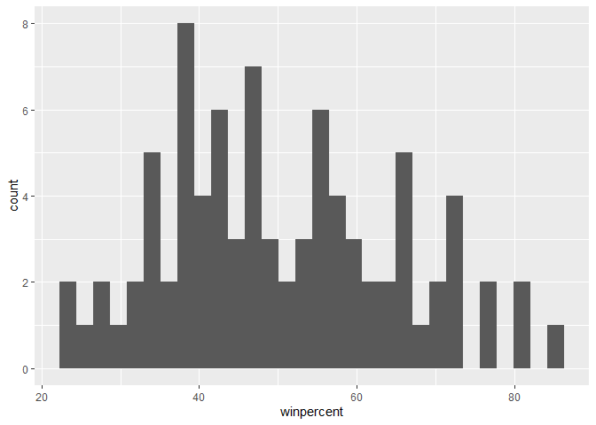
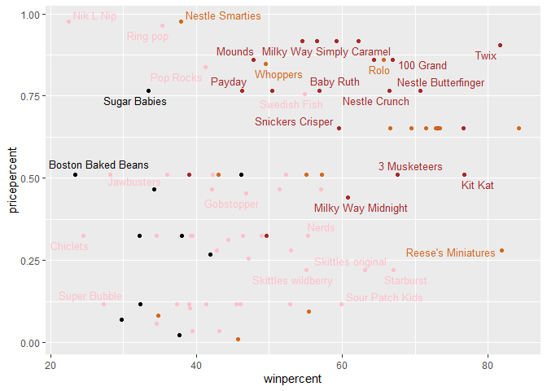
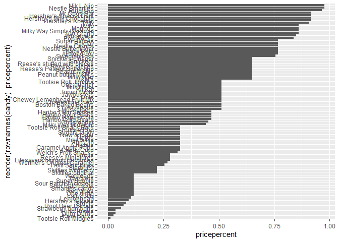

Class10 Mini-project Halloween Candy
================
Dennis Kim

# Import the candy data

``` r
candy_file <- "candy-data.csv"
```

``` r
candy = read.csv(candy_file, row.names=1)
head(candy)
```

                 chocolate fruity caramel peanutyalmondy nougat crispedricewafer
    100 Grand            1      0       1              0      0                1
    3 Musketeers         1      0       0              0      1                0
    One dime             0      0       0              0      0                0
    One quarter          0      0       0              0      0                0
    Air Heads            0      1       0              0      0                0
    Almond Joy           1      0       0              1      0                0
                 hard bar pluribus sugarpercent pricepercent winpercent
    100 Grand       0   1        0        0.732        0.860   66.97173
    3 Musketeers    0   1        0        0.604        0.511   67.60294
    One dime        0   0        0        0.011        0.116   32.26109
    One quarter     0   0        0        0.011        0.511   46.11650
    Air Heads       0   0        0        0.906        0.511   52.34146
    Almond Joy      0   1        0        0.465        0.767   50.34755

> Q1. How many different candy types are in this dataset?

``` r
nrow(candy)
```

    [1] 85

There are 85 different candy types

> Q2. How many fruity candy types are in the dataset?

``` r
sum(candy[,2])
```

    [1] 38

There are 38 fruity candy types

# What is your favorite candy?

One of the most interesting variables in the dataset is `winpercent`.
For a given candy this value is the percentage of people who prefer this
candy over another randomly chosen candy from the dataset (what 538 term
a matchup). Higher values indicate a more popular candy.

We can find the `winpercent` value for Twix by using its name to access
the corresponding row of the dataset. This is because the dataset has
each candy name as rownames (recall that we set this when we imported
the original CSV file). For example the code for Twix is:

``` r
candy["Twix", ]$winpercent
```

    [1] 81.64291

> Q3. What is your favorite candy in the dataset and what is it’s
> winpercent value?

``` r
candy["Twix",]$winpercent
```

    [1] 81.64291

The winpercent of my favorite candy is 81.64. I actually do like Twix :D

> Q4. What is the winpercent value for “Kit Kat”?

``` r
candy["Kit Kat",]$winpercent
```

    [1] 76.7686

The winpercent for kit kat is 76.77

> Q5. What is the winpercent value for “Tootsie Roll Snack Bars”?

``` r
candy["Tootsie Roll Snack Bars",]$winpercent
```

    [1] 49.6535

Tootsie Rolls have a winpercent of 49.65.

Side-note: the skimr::skim() function

There is a useful skim() function in the skimr package that can help
give you a quick overview of a given dataset. Let’s install this package
and try it on our candy data.

``` r
library("skimr")
skim(candy)
```

|                                                  |       |
|:-------------------------------------------------|:------|
| Name                                             | candy |
| Number of rows                                   | 85    |
| Number of columns                                | 12    |
| \_\_\_\_\_\_\_\_\_\_\_\_\_\_\_\_\_\_\_\_\_\_\_   |       |
| Column type frequency:                           |       |
| numeric                                          | 12    |
| \_\_\_\_\_\_\_\_\_\_\_\_\_\_\_\_\_\_\_\_\_\_\_\_ |       |
| Group variables                                  | None  |

Data summary

**Variable type: numeric**

| skim_variable    | n_missing | complete_rate |  mean |    sd |    p0 |   p25 |   p50 |   p75 |  p100 | hist  |
|:-----------------|----------:|--------------:|------:|------:|------:|------:|------:|------:|------:|:------|
| chocolate        |         0 |             1 |  0.44 |  0.50 |  0.00 |  0.00 |  0.00 |  1.00 |  1.00 | ▇▁▁▁▆ |
| fruity           |         0 |             1 |  0.45 |  0.50 |  0.00 |  0.00 |  0.00 |  1.00 |  1.00 | ▇▁▁▁▆ |
| caramel          |         0 |             1 |  0.16 |  0.37 |  0.00 |  0.00 |  0.00 |  0.00 |  1.00 | ▇▁▁▁▂ |
| peanutyalmondy   |         0 |             1 |  0.16 |  0.37 |  0.00 |  0.00 |  0.00 |  0.00 |  1.00 | ▇▁▁▁▂ |
| nougat           |         0 |             1 |  0.08 |  0.28 |  0.00 |  0.00 |  0.00 |  0.00 |  1.00 | ▇▁▁▁▁ |
| crispedricewafer |         0 |             1 |  0.08 |  0.28 |  0.00 |  0.00 |  0.00 |  0.00 |  1.00 | ▇▁▁▁▁ |
| hard             |         0 |             1 |  0.18 |  0.38 |  0.00 |  0.00 |  0.00 |  0.00 |  1.00 | ▇▁▁▁▂ |
| bar              |         0 |             1 |  0.25 |  0.43 |  0.00 |  0.00 |  0.00 |  0.00 |  1.00 | ▇▁▁▁▂ |
| pluribus         |         0 |             1 |  0.52 |  0.50 |  0.00 |  0.00 |  1.00 |  1.00 |  1.00 | ▇▁▁▁▇ |
| sugarpercent     |         0 |             1 |  0.48 |  0.28 |  0.01 |  0.22 |  0.47 |  0.73 |  0.99 | ▇▇▇▇▆ |
| pricepercent     |         0 |             1 |  0.47 |  0.29 |  0.01 |  0.26 |  0.47 |  0.65 |  0.98 | ▇▇▇▇▆ |
| winpercent       |         0 |             1 | 50.32 | 14.71 | 22.45 | 39.14 | 47.83 | 59.86 | 84.18 | ▃▇▆▅▂ |

> Q6. Is there any variable/column that looks to be on a different scale
> to the majority of the other columns in the dataset?

Most of the data tends to sit between 0 and 1, with the exception to the
winpercent row with values that are anywhere from 20 times to as high as
80 times larger than the other values.

> Q7. What do you think a zero and one represent for the
> candy\$chocolate column?

A zero most likely represents that it is not within the quartile range
and a one most likely represents that it is in the quartile range that
it lies under.

> Q8. Plot a histogram of winpercent values

``` r
library(ggplot2)
ggplot(candy, aes(x=winpercent))+ geom_histogram()
```

    `stat_bin()` using `bins = 30`. Pick better value with `binwidth`.



> Q9. Is the distribution of winpercent values symmetrical?

The distrubution is not symmetrical

> Q10. Is the center of the distribution above or below 50%?

``` r
mean(candy$winpercent)
```

    [1] 50.31676

The center of distribution is almost equal to 50%.

> Q11. On average is chocolate candy higher or lower ranked than fruit
> candy?

``` r
choco <- candy$winpercent[as.logical(candy$chocolate)]
fruit <- candy$winpercent[as.logical(candy$fruity)]
mean(choco)
```

    [1] 60.92153

``` r
mean(fruit)
```

    [1] 44.11974

Chocolate is higher ranked than fruity.

> Q12. Is this difference statistically significant?

``` r
t.test(choco,fruit)
```


        Welch Two Sample t-test

    data:  choco and fruit
    t = 6.2582, df = 68.882, p-value = 2.871e-08
    alternative hypothesis: true difference in means is not equal to 0
    95 percent confidence interval:
     11.44563 22.15795
    sample estimates:
    mean of x mean of y 
     60.92153  44.11974 

The difference is statistically significant.

# Overall Candy Rankings

> Q13. What are the five least liked candy types in this set?

``` r
#order sorts from low to high, so we want to see what pops up first to get the least liked.
head(candy[order(candy$winpercent),], n=5)
```

                       chocolate fruity caramel peanutyalmondy nougat
    Nik L Nip                  0      1       0              0      0
    Boston Baked Beans         0      0       0              1      0
    Chiclets                   0      1       0              0      0
    Super Bubble               0      1       0              0      0
    Jawbusters                 0      1       0              0      0
                       crispedricewafer hard bar pluribus sugarpercent pricepercent
    Nik L Nip                         0    0   0        1        0.197        0.976
    Boston Baked Beans                0    0   0        1        0.313        0.511
    Chiclets                          0    0   0        1        0.046        0.325
    Super Bubble                      0    0   0        0        0.162        0.116
    Jawbusters                        0    1   0        1        0.093        0.511
                       winpercent
    Nik L Nip            22.44534
    Boston Baked Beans   23.41782
    Chiclets             24.52499
    Super Bubble         27.30386
    Jawbusters           28.12744

The 5 least liked candies are; Nik L Nip, Boston Baked Beans, Chiclets,
Super Bubble, and Jawbusters.

> Q14. What are the top 5 all time favorite candy types out of this set?

``` r
#order sorts from low to high, so we want to see what is closer to the bottom of the order() function
tail(candy[order(candy$winpercent),], n=5)
```

                              chocolate fruity caramel peanutyalmondy nougat
    Snickers                          1      0       1              1      1
    Kit Kat                           1      0       0              0      0
    Twix                              1      0       1              0      0
    Reese's Miniatures                1      0       0              1      0
    Reese's Peanut Butter cup         1      0       0              1      0
                              crispedricewafer hard bar pluribus sugarpercent
    Snickers                                 0    0   1        0        0.546
    Kit Kat                                  1    0   1        0        0.313
    Twix                                     1    0   1        0        0.546
    Reese's Miniatures                       0    0   0        0        0.034
    Reese's Peanut Butter cup                0    0   0        0        0.720
                              pricepercent winpercent
    Snickers                         0.651   76.67378
    Kit Kat                          0.511   76.76860
    Twix                             0.906   81.64291
    Reese's Miniatures               0.279   81.86626
    Reese's Peanut Butter cup        0.651   84.18029

The 5 most liked candies are; Snickers, Kit Kat, Twix, Reese’s Minatures
and Reese’s Peanut Butter cups.

> Q15. Make a first barplot of candy ranking based on winpercent values.

``` r
library(ggplot2)

ggplot(candy) + 
  aes(winpercent, rownames(candy)) +
  geom_bar(stat='identity')
```


> Q16. This is quite ugly, use the reorder() function to get the bars
> sorted by winpercent?

``` r
ggplot(candy) + 
  aes(winpercent, reorder(rownames(candy),winpercent)) +
  geom_bar(stat='identity')
```


Time to add some useful color Let’s setup a color vector (that signifies
candy type) that we can then use for some future plots. We start by
making a vector of all black values (one for each candy). Then we
overwrite chocolate (for chocolate candy), brown (for candy bars) and
red (for fruity candy) values.

``` r
my_cols=rep("black", nrow(candy))
my_cols[as.logical(candy$chocolate)] = "chocolate"
my_cols[as.logical(candy$bar)] = "brown"
my_cols[as.logical(candy$fruity)] = "pink"
```

Now let’s try our barplot with these colors. Note that we use
fill=my_cols for geom_col(). Experement to see what happens if you use
col=mycols.

``` r
ggplot(candy) + 
  aes(winpercent, reorder(rownames(candy),winpercent)) +
  geom_col(fill=my_cols) 
```


Now, for the first time, using this plot we can answer questions like:
\>Q17. What is the worst ranked chocolate candy?

The worst ranked chocolate candy is Sixlets

> Q18. What is the best ranked fruity candy?

The best ranked fruity candy is Starburst

# Taking a Look at Pricepercent

What about value for money? What is the the best candy for the least
money? One way to get this is to make a plot of winpercent vs the
pricepercent variable. The pricepercent variable records the percentile
rank of the candy’s price against all the other candies in the dataset.
Lower vales are less expensive and high values more expensive.

To this plot we will add text labels so we can more easily identify a
given candy. There is a regular geom_label() that comes with ggplot2.
However, as there are quite a few candies in our dataset lots of these
labels will be overlapping and hard to read. To help with this we can
use the geom_text_repel() function from the ggrepel package.

``` r
library(ggrepel)

# How about a plot of price vs win (too much for pdf render)
ggplot(candy) +  aes(winpercent, pricepercent, label=rownames(candy)) +  geom_point(col=my_cols) +   geom_text_repel(col=my_cols, size=3.3, max.overlaps = 5)
```

    Warning: ggrepel: 54 unlabeled data points (too many overlaps). Consider
    increasing max.overlaps



> Q19. Which candy type is the highest ranked in terms of winpercent for
> the least money - i.e. offers the most bang for your buck?

``` r
ord <- order(candy$pricepercent, decreasing = TRUE)
tail( candy[ord,c(11,12)], n=5 )
```

                         pricepercent winpercent
    Strawberry bon bons         0.058   34.57899
    Dum Dums                    0.034   39.46056
    Fruit Chews                 0.034   43.08892
    Pixie Sticks                0.023   37.72234
    Tootsie Roll Midgies        0.011   45.73675

The highest ranked in terms of winpercent for the lowest pricepercent
are Strawberry bon bons, Dum Dums, Fruit Chews, Pixie Sticks, and
Tootsie Roll Midgies.

> Q20. What are the top 5 most expensive candy types in the dataset and
> of these which is the least popular?

``` r
ord <- order(candy$pricepercent, decreasing = TRUE)
head( candy[ord,c(11,12)], n=5 )
```

                             pricepercent winpercent
    Nik L Nip                       0.976   22.44534
    Nestle Smarties                 0.976   37.88719
    Ring pop                        0.965   35.29076
    Hershey's Krackel               0.918   62.28448
    Hershey's Milk Chocolate        0.918   56.49050

The 5 most expensive are Nik L Nip, Neslte Smarties, Ring Pop, Hershey’s
Krackel, and Hershey’s Milk Chocolate. The least popular among these are
Nik L Nip.

Optional \>Q21. Make a barplot again with geom_col() this time using
pricepercent and then improve this step by step, first ordering the
x-axis by value and finally making a so called “dot chat” or “lollipop”
chart by swapping geom_col() for geom_point() + geom_segment().

``` r
# Make a barplot with col and pricepercent
ggplot(candy) +
  aes(pricepercent, reorder(rownames(candy), pricepercent)) +
  geom_segment(aes(yend = reorder(rownames(candy), pricepercent), 
                   xend = 0), col="gray40") +
    geom_col()
```



``` r
# Make a lollipop chart of pricepercent
ggplot(candy) +
  aes(pricepercent, reorder(rownames(candy), pricepercent)) +
  geom_segment(aes(yend = reorder(rownames(candy), pricepercent), 
                   xend = 0), col="gray40") +
    geom_point()
```


# Exploring correlation structure

Load the program corrplot

``` r
library(corrplot)
```

    corrplot 0.92 loaded

``` r
cij <- cor(candy)
corrplot(cij)
```


> Q22. Examining this plot what two variables are anti-correlated
> (i.e. have minus values)?

Chocolate and fruit have the largest minus values and are the least
correlated.

> Q23. Similarly, what two variables are most positively correlated?

The variables that match in name and go in diagonal are the most
positively correlated, but aside from that the next most positively
correlated variables are chocolates and winpercent.

# Principal Component Analysis

Time to apply PCA

``` r
pca <- prcomp(candy, scale=TRUE)
summary(pca)
```

    Importance of components:
                              PC1    PC2    PC3     PC4    PC5     PC6     PC7
    Standard deviation     2.0788 1.1378 1.1092 1.07533 0.9518 0.81923 0.81530
    Proportion of Variance 0.3601 0.1079 0.1025 0.09636 0.0755 0.05593 0.05539
    Cumulative Proportion  0.3601 0.4680 0.5705 0.66688 0.7424 0.79830 0.85369
                               PC8     PC9    PC10    PC11    PC12
    Standard deviation     0.74530 0.67824 0.62349 0.43974 0.39760
    Proportion of Variance 0.04629 0.03833 0.03239 0.01611 0.01317
    Cumulative Proportion  0.89998 0.93832 0.97071 0.98683 1.00000

Now plot PC1 vs PC2

``` r
plot(pca$x[,1:2])
```


Add some color

``` r
plot(pca$x[,1:2], col=my_cols, pch=16)
```


Can also do in ggplot

``` r
# Make a new data-frame with our PCA results and candy data
my_data <- cbind(candy, pca$x[,1:3])
```

``` r
p <- ggplot(my_data) + 
        aes(x=PC1, y=PC2, 
            size=winpercent/100,  
            text=rownames(my_data),
            label=rownames(my_data)) +
        geom_point(col=my_cols)

p
```


Again we can use the ggrepel package and the function
ggrepel::geom_text_repel() to label up the plot with non overlapping
candy names like. We will also add a title and subtitle like so:

``` r
#library(ggrepel)
#too much for pdf rendering
#p + geom_text_repel(size=3.3, col=my_cols, max.overlaps = 7)  +   theme(legend.position = "none") +  labs(title="Halloween Candy PCA Space", subtitle="Colored by type: chocolate bar (dark brown), chocolate other (light brown), fruity (red), other (black)",caption="Data from 538")
```

If you want to see more candy labels you can change the max.overlaps
value to allow more overlapping labels or pass the ggplot object p to
plotly like so to generate an interactive plot that you can mouse over
to see labels:

``` r
#library(plotly)
#ggplotly(p)
```

Let’s finish by taking a quick look at PCA our loadings. Do these make
sense to you? Notice the opposite effects of chocolate and fruity and
the similar effects of chocolate and bar (i.e. we already know they are
correlated).

``` r
par(mar=c(8,4,2,2))
barplot(pca$rotation[,1], las=2, ylab="PC1 Contribution")
```


> Q24. What original variables are picked up strongly by PC1 in the
> positive direction? Do these make sense to you?

Hard, fruity candies that are also packed in a bag/come in a box of
multiple are strongly positive in PC1. These make sense as there are
candies like Jolly Ranchers that match the three categories.
