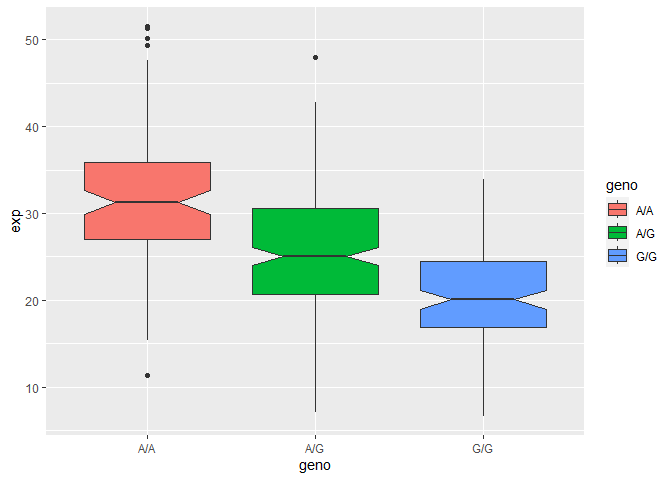

Class 11 Lab
================
Dennis Kim

\#Population Scale Analysis

> Q13: Read this file into R and determine the sample size for each
> genotype and their corresponding median expression levels for each of
> these genotypes

``` r
pop.data <- read.table("rs8067378_ENSG00000172057.6.txt")
summary(pop.data)
```

        sample              geno                exp        
     Length:462         Length:462         Min.   : 6.675  
     Class :character   Class :character   1st Qu.:20.004  
     Mode  :character   Mode  :character   Median :25.116  
                                           Mean   :25.640  
                                           3rd Qu.:30.779  
                                           Max.   :51.518  

There are 462 samples in total

``` r
table(pop.data$geno)
```


    A/A A/G G/G 
    108 233 121 

There are 108 homozygous A, 233 heterozygous A/G, and 121 homozygous G.

``` r
library(ggplot2)
```

``` r
boxplot <- ggplot(pop.data) + aes(geno, exp, fill=geno) + geom_boxplot(notch=TRUE)
boxplot
```



``` r
summary(boxplot$data)
```

        sample              geno                exp        
     Length:462         Length:462         Min.   : 6.675  
     Class :character   Class :character   1st Qu.:20.004  
     Mode  :character   Mode  :character   Median :25.116  
                                           Mean   :25.640  
                                           3rd Qu.:30.779  
                                           Max.   :51.518  

AA has a median of 30, AG has a median of 25 and GG has a median of 20

> Q14: Generate a boxplot with a box per genotype, what could you infer
> from the relative expression value between A/A and G/G displayed in
> this plot? Does the SNP effect the expression of ORMDL3?

Time for a boxplot

``` r
library(ggplot2)
```

``` r
boxplot <- ggplot(pop.data) + aes(geno, exp, fill=geno) + geom_boxplot(notch=TRUE)
boxplot
```


The expression of AA is much higher than the expression of GG,
indicating that the SNP affects the expression of ORMDL3
