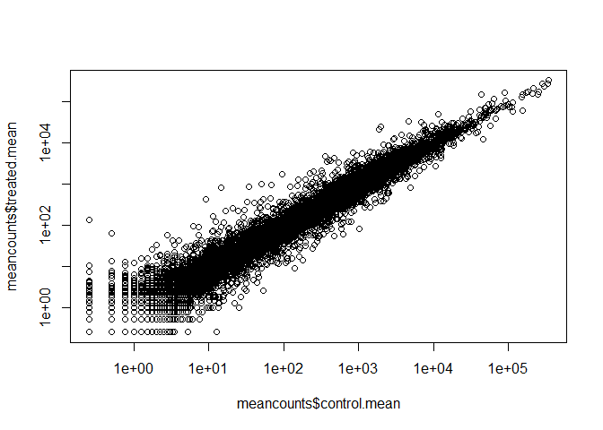
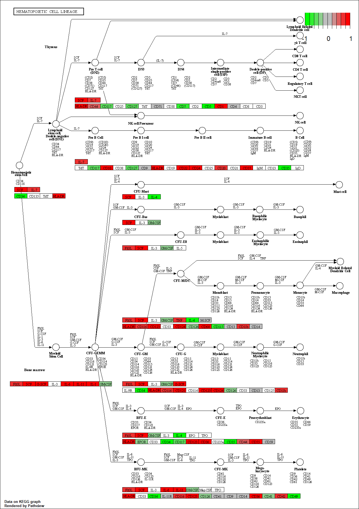

Class12 and 13
================
Dennis Kim

## Class12

# 1. Bioconductor and DeSeq Setup

Load library packages

``` r
library(BiocManager)
library(DESeq2)
```

Read data into R

``` r
counts <- read.csv("airway_scaledcounts.csv", row.names=1)
metadata <- read.csv("airway_metadata.csv")
```

Take a look at each

``` r
head(counts)
```

                    SRR1039508 SRR1039509 SRR1039512 SRR1039513 SRR1039516
    ENSG00000000003        723        486        904        445       1170
    ENSG00000000005          0          0          0          0          0
    ENSG00000000419        467        523        616        371        582
    ENSG00000000457        347        258        364        237        318
    ENSG00000000460         96         81         73         66        118
    ENSG00000000938          0          0          1          0          2
                    SRR1039517 SRR1039520 SRR1039521
    ENSG00000000003       1097        806        604
    ENSG00000000005          0          0          0
    ENSG00000000419        781        417        509
    ENSG00000000457        447        330        324
    ENSG00000000460         94        102         74
    ENSG00000000938          0          0          0

``` r
head(metadata)
```

              id     dex celltype     geo_id
    1 SRR1039508 control   N61311 GSM1275862
    2 SRR1039509 treated   N61311 GSM1275863
    3 SRR1039512 control  N052611 GSM1275866
    4 SRR1039513 treated  N052611 GSM1275867
    5 SRR1039516 control  N080611 GSM1275870
    6 SRR1039517 treated  N080611 GSM1275871

Let’s make sure that the id column of the metadata match the order of
the columns in Count- Data

``` r
all(metadata$id == colnames(counts))
```

    [1] TRUE

> Q1. How many genes are in this dataset?

``` r
dim(counts)
```

    [1] 38694     8

38694 genes

> Q2. How many ‘control’ cell lines do we have

``` r
View(metadata[,2])
```

There are 4 control lines

# Toy differential gene expression

Lets perform some exploratory differential gene expression analysis.
Note: this analysis is for demonstration only. NEVER do differential
expression analysis this way! Note that the control samples are
SRR1039508, SRR1039512, SRR1039516, and SRR1039520.This bit of code will
first find the sample id for those labeled control. Then calculate the
mean counts per gene across these samples:

``` r
control <- metadata[metadata[,"dex"]=="control",]
control.counts <- counts[ ,control$id]
control.mean <- rowSums( control.counts )/4
head(control.mean)
```

    ENSG00000000003 ENSG00000000005 ENSG00000000419 ENSG00000000457 ENSG00000000460 
             900.75            0.00          520.50          339.75           97.25 
    ENSG00000000938 
               0.75 

Side-note: An alternative way to do this same thing using the dplyr
package from the tidyverse is shown below. Which do you prefer and why?

``` r
library(dplyr)
```

``` r
control <- metadata %>% filter(dex=="control")
control.counts <- counts %>% select(control$id)
control.mean <- rowSums(control.counts)/4
head(control.mean)
```

    ENSG00000000003 ENSG00000000005 ENSG00000000419 ENSG00000000457 ENSG00000000460 
             900.75            0.00          520.50          339.75           97.25 
    ENSG00000000938 
               0.75 

> Q3. How would oyu make the above code in either approach more robust?

Use the apply() function Let’s extract first extract our counts for
control samples as I want to compare this to the counts treated
(i.e. with drug) samples.

``` r
control.inds <- metadata$dex == "control"
control.ids <- metadata$id[control.inds]
control.counts <- counts[, control.ids]
head(control.counts)
```

                    SRR1039508 SRR1039512 SRR1039516 SRR1039520
    ENSG00000000003        723        904       1170        806
    ENSG00000000005          0          0          0          0
    ENSG00000000419        467        616        582        417
    ENSG00000000457        347        364        318        330
    ENSG00000000460         96         73        118        102
    ENSG00000000938          0          1          2          0

Let’s summarize and get one value per gene in the control experiments.
I’ll start by taking the average

``` r
#apply(control.counts, 1, mean)
#can also use `rowMeans()`
control.mean <- rowMeans(control.counts)
```

> Q4. Follow the same procedure for the treated samples (i.e. calculate
> the mean per gene across drug treated samples and assign to a labeled
> vector called treated.mean)

``` r
treated.inds <- metadata$dex == "treated"
treated.ids <- metadata$id[treated.inds]
treated.counts <- counts[, treated.ids]
treated.mean <- rowMeans(treated.counts)

meancounts <- data.frame(control.mean, treated.mean)
head(meancounts)
```

                    control.mean treated.mean
    ENSG00000000003       900.75       658.00
    ENSG00000000005         0.00         0.00
    ENSG00000000419       520.50       546.00
    ENSG00000000457       339.75       316.50
    ENSG00000000460        97.25        78.75
    ENSG00000000938         0.75         0.00

Time to make a plot \> Q5 (a). Create a scatter plot showing the mean of
the treated samples against the mean of the control samples. Your plot
should look something like the following.

``` r
plot(meancounts$control.mean, meancounts$treated.mean)
```


> Q5 (b).You could also use the ggplot2 package to make this figure
> producing the plot below. What geom\_?() function would you use for
> this plot?

``` r
library(ggplot2)
ggplot(meancounts, aes(control.mean, treated.mean)) + geom_point()
```


Lets put this on a log scale \> Q6. Try plotting both axes on a log
scale. What is the argument to plot() that allows you to do this?

``` r
plot(meancounts$control.mean, meancounts$treated.mean, log="xy")
```

    Warning in xy.coords(x, y, xlabel, ylabel, log): 15032 x values <= 0 omitted
    from logarithmic plot

    Warning in xy.coords(x, y, xlabel, ylabel, log): 15281 y values <= 0 omitted
    from logarithmic plot



``` r
ggplot(meancounts, aes(control.mean, treated.mean)) + geom_point() + scale_x_continuous(trans="log2")
```

    Warning: Transformation introduced infinite values in continuous x-axis


The most useful and most straightforward to understand is log2
transformation Let’s add a log2 fold-change

``` r
meancounts$log2fc <- log2(meancounts$treated.mean/meancounts$control.mean)
head(meancounts)
```

                    control.mean treated.mean      log2fc
    ENSG00000000003       900.75       658.00 -0.45303916
    ENSG00000000005         0.00         0.00         NaN
    ENSG00000000419       520.50       546.00  0.06900279
    ENSG00000000457       339.75       316.50 -0.10226805
    ENSG00000000460        97.25        78.75 -0.30441833
    ENSG00000000938         0.75         0.00        -Inf

We need to remove the genes where we have no count data as taking the
log2 of these 0 counts does not tell us anything. \> Q7. What is the
purpose of the arr.ind argument in the which() function call above? Why
would we then take the first column of the output and need to call the
unique() function?

``` r
#alternative way
zero.vals <- which(meancounts[,1:2]==0, arr.ind=TRUE)
to.rm <- unique(zero.vals[,1])
mycounts <- meancounts[-to.rm,]
head(mycounts)
```

                    control.mean treated.mean      log2fc
    ENSG00000000003       900.75       658.00 -0.45303916
    ENSG00000000419       520.50       546.00  0.06900279
    ENSG00000000457       339.75       316.50 -0.10226805
    ENSG00000000460        97.25        78.75 -0.30441833
    ENSG00000000971      5219.00      6687.50  0.35769358
    ENSG00000001036      2327.00      1785.75 -0.38194109

arr.ind() returns the positions of the parts of mean counts from columns
1 to 2 that are equal to 0. We only take the first column and call them
unique on the first column in order to ensure that the rows are not
removed twice if there are zeros for both values in the samples. Using
this method:

``` r
to.keep <- rowSums(meancounts[,1:2] == 0) == 0
my.counts <- meancounts[to.keep,]
head(my.counts)
```

                    control.mean treated.mean      log2fc
    ENSG00000000003       900.75       658.00 -0.45303916
    ENSG00000000419       520.50       546.00  0.06900279
    ENSG00000000457       339.75       316.50 -0.10226805
    ENSG00000000460        97.25        78.75 -0.30441833
    ENSG00000000971      5219.00      6687.50  0.35769358
    ENSG00000001036      2327.00      1785.75 -0.38194109

``` r
nrow(my.counts)
```

    [1] 21817

> Q8. Using the up.ind vector above can you determine how many up
> regulated genes we have at the greater than 2 fc level?

How many genes are upregulated at the log2fc level of +2

``` r
sum(mycounts$log2fc >= +2)
```

    [1] 314

There are 314 upregulated genes

> Q9. Using the down.ind vector above can you determine how many down
> regulated genes we have at the greater than 2 fc level?

``` r
sum(mycounts$log2fc <= -2)
```

    [1] 485

485 are downregulated

> Q10. Do you trust these results? Why or why not?

We did not do any statistical tests so we do not know if the changes are
significant or consistent.

# DESeq2 Analysis

``` r
library(DESeq2)
```

Like most bioconductor packages, DESeq2 wants it’s input and output in a
very specific format.

``` r
dds <- DESeqDataSetFromMatrix(countData=counts, colData=metadata, design=~dex)
```

    converting counts to integer mode

    Warning in DESeqDataSet(se, design = design, ignoreRank): some variables in
    design formula are characters, converting to factors

The main DESeq function is called DESeq

``` r
dds <- DESeq(dds)
```

    estimating size factors

    estimating dispersions

    gene-wise dispersion estimates

    mean-dispersion relationship

    final dispersion estimates

    fitting model and testing

``` r
res <- results(dds)
head(res)
```

    log2 fold change (MLE): dex treated vs control 
    Wald test p-value: dex treated vs control 
    DataFrame with 6 rows and 6 columns
                      baseMean log2FoldChange     lfcSE      stat    pvalue
                     <numeric>      <numeric> <numeric> <numeric> <numeric>
    ENSG00000000003 747.194195     -0.3507030  0.168246 -2.084470 0.0371175
    ENSG00000000005   0.000000             NA        NA        NA        NA
    ENSG00000000419 520.134160      0.2061078  0.101059  2.039475 0.0414026
    ENSG00000000457 322.664844      0.0245269  0.145145  0.168982 0.8658106
    ENSG00000000460  87.682625     -0.1471420  0.257007 -0.572521 0.5669691
    ENSG00000000938   0.319167     -1.7322890  3.493601 -0.495846 0.6200029
                         padj
                    <numeric>
    ENSG00000000003  0.163035
    ENSG00000000005        NA
    ENSG00000000419  0.176032
    ENSG00000000457  0.961694
    ENSG00000000460  0.815849
    ENSG00000000938        NA

``` r
summary(res)
```


    out of 25258 with nonzero total read count
    adjusted p-value < 0.1
    LFC > 0 (up)       : 1563, 6.2%
    LFC < 0 (down)     : 1188, 4.7%
    outliers [1]       : 142, 0.56%
    low counts [2]     : 9971, 39%
    (mean count < 10)
    [1] see 'cooksCutoff' argument of ?results
    [2] see 'independentFiltering' argument of ?results

The results function contains a number of arguments to customize the
results table. By default the argument alpha is set to 0.1. If the
adjusted p value cutoff will be a value other than 0.1, alpha should be
set to that value:

``` r
res05 <- results(dds, alpha=0.05)
summary(res05)
```


    out of 25258 with nonzero total read count
    adjusted p-value < 0.05
    LFC > 0 (up)       : 1236, 4.9%
    LFC < 0 (down)     : 933, 3.7%
    outliers [1]       : 142, 0.56%
    low counts [2]     : 9033, 36%
    (mean count < 6)
    [1] see 'cooksCutoff' argument of ?results
    [2] see 'independentFiltering' argument of ?results

# Adding Annotation Data

Load packages

``` r
library("AnnotationDbi")
```


    Attaching package: 'AnnotationDbi'

    The following object is masked from 'package:dplyr':

        select

``` r
library("org.Hs.eg.db")
```

All the key types we can use to label

``` r
columns(org.Hs.eg.db)
```

     [1] "ACCNUM"       "ALIAS"        "ENSEMBL"      "ENSEMBLPROT"  "ENSEMBLTRANS"
     [6] "ENTREZID"     "ENZYME"       "EVIDENCE"     "EVIDENCEALL"  "GENENAME"    
    [11] "GENETYPE"     "GO"           "GOALL"        "IPI"          "MAP"         
    [16] "OMIM"         "ONTOLOGY"     "ONTOLOGYALL"  "PATH"         "PFAM"        
    [21] "PMID"         "PROSITE"      "REFSEQ"       "SYMBOL"       "UCSCKG"      
    [26] "UNIPROT"     

We can use the mapIds() function to add individual columns to our
results table. We provide the row names of our results table as a key,
and specify that keytype=ENSEMBL. The column argument tells the mapIds()
function which information we want, and the multiVals argument tells the
function what to do if there are multiple possible values for a single
input value. Here we ask to just give us back the first one that occurs
in the database.

``` r
res$symbol <- mapIds(org.Hs.eg.db,
                    keys=row.names(res), # Our genenames
                    keytype="ENSEMBL", # The format of our genenames
                    column="SYMBOL", # The new format we want to add
                    multiVals="first")
```

    'select()' returned 1:many mapping between keys and columns

``` r
head(res)
```

    log2 fold change (MLE): dex treated vs control 
    Wald test p-value: dex treated vs control 
    DataFrame with 6 rows and 7 columns
                      baseMean log2FoldChange     lfcSE      stat    pvalue
                     <numeric>      <numeric> <numeric> <numeric> <numeric>
    ENSG00000000003 747.194195     -0.3507030  0.168246 -2.084470 0.0371175
    ENSG00000000005   0.000000             NA        NA        NA        NA
    ENSG00000000419 520.134160      0.2061078  0.101059  2.039475 0.0414026
    ENSG00000000457 322.664844      0.0245269  0.145145  0.168982 0.8658106
    ENSG00000000460  87.682625     -0.1471420  0.257007 -0.572521 0.5669691
    ENSG00000000938   0.319167     -1.7322890  3.493601 -0.495846 0.6200029
                         padj      symbol
                    <numeric> <character>
    ENSG00000000003  0.163035      TSPAN6
    ENSG00000000005        NA        TNMD
    ENSG00000000419  0.176032        DPM1
    ENSG00000000457  0.961694       SCYL3
    ENSG00000000460  0.815849    C1orf112
    ENSG00000000938        NA         FGR

> Q11. Run the mapIds() function two more times to add the Entrez ID
> andUniProt accession and GENENAME as new columns called resentrez,
> uniprot and res\$genename.

``` r
res$entrez <- mapIds(org.Hs.eg.db,
                    keys=row.names(res),
                    column="ENTREZID",
                    keytype="ENSEMBL",
                    multiVals="first")
```

    'select()' returned 1:many mapping between keys and columns

``` r
res$uniprot <- mapIds(org.Hs.eg.db,
                    keys=row.names(res),
                    column="UNIPROT",
                    keytype="ENSEMBL",
                    multiVals="first")
```

    'select()' returned 1:many mapping between keys and columns

``` r
res$genename <- mapIds(org.Hs.eg.db,
                    keys=row.names(res),
                    column="GENENAME",
                    keytype="ENSEMBL",
                    multiVals="first")
```

    'select()' returned 1:many mapping between keys and columns

``` r
head(res)
```

    log2 fold change (MLE): dex treated vs control 
    Wald test p-value: dex treated vs control 
    DataFrame with 6 rows and 10 columns
                      baseMean log2FoldChange     lfcSE      stat    pvalue
                     <numeric>      <numeric> <numeric> <numeric> <numeric>
    ENSG00000000003 747.194195     -0.3507030  0.168246 -2.084470 0.0371175
    ENSG00000000005   0.000000             NA        NA        NA        NA
    ENSG00000000419 520.134160      0.2061078  0.101059  2.039475 0.0414026
    ENSG00000000457 322.664844      0.0245269  0.145145  0.168982 0.8658106
    ENSG00000000460  87.682625     -0.1471420  0.257007 -0.572521 0.5669691
    ENSG00000000938   0.319167     -1.7322890  3.493601 -0.495846 0.6200029
                         padj      symbol      entrez     uniprot
                    <numeric> <character> <character> <character>
    ENSG00000000003  0.163035      TSPAN6        7105  A0A024RCI0
    ENSG00000000005        NA        TNMD       64102      Q9H2S6
    ENSG00000000419  0.176032        DPM1        8813      O60762
    ENSG00000000457  0.961694       SCYL3       57147      Q8IZE3
    ENSG00000000460  0.815849    C1orf112       55732  A0A024R922
    ENSG00000000938        NA         FGR        2268      P09769
                                  genename
                               <character>
    ENSG00000000003          tetraspanin 6
    ENSG00000000005            tenomodulin
    ENSG00000000419 dolichyl-phosphate m..
    ENSG00000000457 SCY1 like pseudokina..
    ENSG00000000460 chromosome 1 open re..
    ENSG00000000938 FGR proto-oncogene, ..

Arrange and order by adjusted p-value

``` r
ord <- order( res$padj )
#View(res[ord,])
head(res[ord,])
```

    log2 fold change (MLE): dex treated vs control 
    Wald test p-value: dex treated vs control 
    DataFrame with 6 rows and 10 columns
                     baseMean log2FoldChange     lfcSE      stat      pvalue
                    <numeric>      <numeric> <numeric> <numeric>   <numeric>
    ENSG00000152583   954.771        4.36836 0.2371268   18.4220 8.74490e-76
    ENSG00000179094   743.253        2.86389 0.1755693   16.3120 8.10784e-60
    ENSG00000116584  2277.913       -1.03470 0.0650984  -15.8944 6.92855e-57
    ENSG00000189221  2383.754        3.34154 0.2124058   15.7319 9.14433e-56
    ENSG00000120129  3440.704        2.96521 0.2036951   14.5571 5.26424e-48
    ENSG00000148175 13493.920        1.42717 0.1003890   14.2164 7.25128e-46
                           padj      symbol      entrez     uniprot
                      <numeric> <character> <character> <character>
    ENSG00000152583 1.32441e-71     SPARCL1        8404  A0A024RDE1
    ENSG00000179094 6.13966e-56        PER1        5187      O15534
    ENSG00000116584 3.49776e-53     ARHGEF2        9181      Q92974
    ENSG00000189221 3.46227e-52        MAOA        4128      P21397
    ENSG00000120129 1.59454e-44       DUSP1        1843      B4DU40
    ENSG00000148175 1.83034e-42        STOM        2040      F8VSL7
                                  genename
                               <character>
    ENSG00000152583           SPARC like 1
    ENSG00000179094 period circadian reg..
    ENSG00000116584 Rho/Rac guanine nucl..
    ENSG00000189221    monoamine oxidase A
    ENSG00000120129 dual specificity pho..
    ENSG00000148175               stomatin

Write the ordered significant results

``` r
write.csv(res[ord,], "deseq_results.csv")
```

# Volcono Plots

A major summary figure of this type of analysis is called a volcano
plot, the idea is to keep our inner biologist and inner statistician
happy

``` r
plot(res$log2FoldChange, res$padj)
```


Improve this plot by taking the log of the p-value axis

``` r
plot(res$log2FoldChange, log(res$padj))
```


I want to flip this y axis so the values I care about (i.e. the low
p-values or high log(p-values)) are at the top of the axis

``` r
plot(res$log2FoldChange, -log(res$padj), xlab="Log2(FoldChange)", ylab="-Log(P-value)")
# Add some cut-off lines
abline(v=c(-2,2), col="darkgray", lty=2)
abline(h=-log(0.05), col="darkgray", lty=2)
```


Colors

``` r
# Setup our custom point color vector
mycols <- rep("gray", nrow(res))
mycols[ abs(res$log2FoldChange) > 2 ] <- "red"
inds <- (res$padj < 0.01) & (abs(res$log2FoldChange) > 2 )
mycols[ inds ] <- "blue"
# Volcano plot with custom colors
plot( res$log2FoldChange, -log(res$padj),
col=mycols, ylab="-Log(P-value)", xlab="Log2(FoldChange)" )
# Cut-off lines
abline(v=c(-2,2), col="gray", lty=2)
abline(h=-log(0.1), col="gray", lty=2)
```


## Class13

# Section 1. Differential Expression Analysis

``` r
library(DESeq2)
```

Load the data files

``` r
metaFile <- "GSE37704_metadata.csv"
countFile <- "GSE37704_featurecounts.csv"

# Import metadata and take a peak
colData = read.csv(metaFile, row.names=1)
head(colData)
```

                  condition
    SRR493366 control_sirna
    SRR493367 control_sirna
    SRR493368 control_sirna
    SRR493369      hoxa1_kd
    SRR493370      hoxa1_kd
    SRR493371      hoxa1_kd

``` r
# Import countdata
countData = read.csv(countFile, row.names=1)
head(countData)
```

                    length SRR493366 SRR493367 SRR493368 SRR493369 SRR493370
    ENSG00000186092    918         0         0         0         0         0
    ENSG00000279928    718         0         0         0         0         0
    ENSG00000279457   1982        23        28        29        29        28
    ENSG00000278566    939         0         0         0         0         0
    ENSG00000273547    939         0         0         0         0         0
    ENSG00000187634   3214       124       123       205       207       212
                    SRR493371
    ENSG00000186092         0
    ENSG00000279928         0
    ENSG00000279457        46
    ENSG00000278566         0
    ENSG00000273547         0
    ENSG00000187634       258

> Q. Complete the code below to remove the troublesome first column from
> countData

``` r
# Note we need to remove the odd first $length col
countData <- as.matrix(countData[,-1])
head(countData)
```

                    SRR493366 SRR493367 SRR493368 SRR493369 SRR493370 SRR493371
    ENSG00000186092         0         0         0         0         0         0
    ENSG00000279928         0         0         0         0         0         0
    ENSG00000279457        23        28        29        29        28        46
    ENSG00000278566         0         0         0         0         0         0
    ENSG00000273547         0         0         0         0         0         0
    ENSG00000187634       124       123       205       207       212       258

Check that my metadata and count data match

``` r
rownames(colData)
```

    [1] "SRR493366" "SRR493367" "SRR493368" "SRR493369" "SRR493370" "SRR493371"

``` r
colnames(countData)
```

    [1] "SRR493366" "SRR493367" "SRR493368" "SRR493369" "SRR493370" "SRR493371"

``` r
rownames(colData)==colnames(countData)
```

    [1] TRUE TRUE TRUE TRUE TRUE TRUE

``` r
all(rownames(colData) == colnames(countData))
```

    [1] TRUE

This looks better but there are lots of zero entries in there so let’s
get rid of them as we have no data for these.

> Q. Complete the code below to filter countData to exclude genes
> (i.e. rows) where we have 0 read count across all samples
> (i.e. columns).

``` r
#head(countData)
to.keep <- rowSums(countData) != 0
countData <- countData[to.keep,]

nrow(countData)
```

    [1] 15975

``` r
head(countData)
```

                    SRR493366 SRR493367 SRR493368 SRR493369 SRR493370 SRR493371
    ENSG00000279457        23        28        29        29        28        46
    ENSG00000187634       124       123       205       207       212       258
    ENSG00000188976      1637      1831      2383      1226      1326      1504
    ENSG00000187961       120       153       180       236       255       357
    ENSG00000187583        24        48        65        44        48        64
    ENSG00000187642         4         9        16        14        16        16

## Run DESeq2

``` r
library(DESeq2)
```

``` r
head(colData)
```

                  condition
    SRR493366 control_sirna
    SRR493367 control_sirna
    SRR493368 control_sirna
    SRR493369      hoxa1_kd
    SRR493370      hoxa1_kd
    SRR493371      hoxa1_kd

Set up the object that DESeq needs for analysis with the lovely log
function, and run DESeq analysis

``` r
dds = DESeqDataSetFromMatrix(countData=countData,
                             colData=colData,
                             design=~condition)
```

    Warning in DESeqDataSet(se, design = design, ignoreRank): some variables in
    design formula are characters, converting to factors

``` r
dds = DESeq(dds)
```

    estimating size factors

    estimating dispersions

    gene-wise dispersion estimates

    mean-dispersion relationship

    final dispersion estimates

    fitting model and testing

``` r
dds
```

    class: DESeqDataSet 
    dim: 15975 6 
    metadata(1): version
    assays(4): counts mu H cooks
    rownames(15975): ENSG00000279457 ENSG00000187634 ... ENSG00000276345
      ENSG00000271254
    rowData names(22): baseMean baseVar ... deviance maxCooks
    colnames(6): SRR493366 SRR493367 ... SRR493370 SRR493371
    colData names(2): condition sizeFactor

``` r
res <- results(dds)
res
```

    log2 fold change (MLE): condition hoxa1 kd vs control sirna 
    Wald test p-value: condition hoxa1 kd vs control sirna 
    DataFrame with 15975 rows and 6 columns
                     baseMean log2FoldChange     lfcSE       stat      pvalue
                    <numeric>      <numeric> <numeric>  <numeric>   <numeric>
    ENSG00000279457   29.9136      0.1792571 0.3248216   0.551863 5.81042e-01
    ENSG00000187634  183.2296      0.4264571 0.1402658   3.040350 2.36304e-03
    ENSG00000188976 1651.1881     -0.6927205 0.0548465 -12.630158 1.43990e-36
    ENSG00000187961  209.6379      0.7297556 0.1318599   5.534326 3.12428e-08
    ENSG00000187583   47.2551      0.0405765 0.2718928   0.149237 8.81366e-01
    ...                   ...            ...       ...        ...         ...
    ENSG00000273748  35.30265       0.674387  0.303666   2.220817 2.63633e-02
    ENSG00000278817   2.42302      -0.388988  1.130394  -0.344117 7.30758e-01
    ENSG00000278384   1.10180       0.332991  1.660261   0.200565 8.41039e-01
    ENSG00000276345  73.64496      -0.356181  0.207716  -1.714752 8.63908e-02
    ENSG00000271254 181.59590      -0.609667  0.141320  -4.314071 1.60276e-05
                           padj
                      <numeric>
    ENSG00000279457 6.86555e-01
    ENSG00000187634 5.15718e-03
    ENSG00000188976 1.76549e-35
    ENSG00000187961 1.13413e-07
    ENSG00000187583 9.19031e-01
    ...                     ...
    ENSG00000273748 4.79091e-02
    ENSG00000278817 8.09772e-01
    ENSG00000278384 8.92654e-01
    ENSG00000276345 1.39762e-01
    ENSG00000271254 4.53648e-05

Next, get results for the HoxA1 knockdown versus control siRNA (remember
that these were labeled as “hoxa1_kd” and “control_sirna” in our
original colData metaFile input to DESeq, you can check this above and
by running resultsNames(dds) command).

``` r
res = results(dds, contrast=c("condition", "hoxa1_kd", "control_sirna"))
```

> Q. Call the summary() function on your results to get a sense of how
> many genes are up or down-regulated at the default 0.1 p-value cutoff.

``` r
summary(res)
```


    out of 15975 with nonzero total read count
    adjusted p-value < 0.1
    LFC > 0 (up)       : 4349, 27%
    LFC < 0 (down)     : 4396, 28%
    outliers [1]       : 0, 0%
    low counts [2]     : 1237, 7.7%
    (mean count < 0)
    [1] see 'cooksCutoff' argument of ?results
    [2] see 'independentFiltering' argument of ?results

4349 upregulated, 4396 downregulated

## Volcono Plot

``` r
plot( res$log2FoldChange, -log(res$padj) )
```


``` r
# Make a color vector for all genes
mycols <- rep("gray", nrow(res) )
mycols[ abs(res$log2FoldChange) > 2 ] <- "red"
inds <- (res$padj < 0.01) & (abs(res$log2FoldChange) > 2 )
mycols[ inds ] <- "blue"
plot( res$log2FoldChange, -log(res$padj), col=mycols, xlab="Log2(FoldChange)", ylab="-Log(P-value)" )
abline(v=c(-2,2), lty=2)
```


## Adding Gene Annotation

Since we mapped and counted against the Ensembl annotation, our results
only have information about Ensembl gene IDs. However, our pathway
analysis downstream will use KEGG pathways, and genes in KEGG pathways
are annotated with Entrez gene IDs. So lets add them as we did the last
day.

> Q. Use the mapIDs() function multiple times to add SYMBOL, ENTREZID
> and GENENAME annotation to our results by completing the code below.

``` r
library("AnnotationDbi")
library("org.Hs.eg.db")

columns(org.Hs.eg.db)
```

     [1] "ACCNUM"       "ALIAS"        "ENSEMBL"      "ENSEMBLPROT"  "ENSEMBLTRANS"
     [6] "ENTREZID"     "ENZYME"       "EVIDENCE"     "EVIDENCEALL"  "GENENAME"    
    [11] "GENETYPE"     "GO"           "GOALL"        "IPI"          "MAP"         
    [16] "OMIM"         "ONTOLOGY"     "ONTOLOGYALL"  "PATH"         "PFAM"        
    [21] "PMID"         "PROSITE"      "REFSEQ"       "SYMBOL"       "UCSCKG"      
    [26] "UNIPROT"     

``` r
res$symbol = mapIds(org.Hs.eg.db,
                    keys=row.names(res), 
                    keytype="ENSEMBL",
                    column="SYMBOL",
                    multiVals="first")
```

    'select()' returned 1:many mapping between keys and columns

``` r
res$entrez = mapIds(org.Hs.eg.db,
                    keys=row.names(res),
                    keytype="ENSEMBL",
                    column="ENTREZID",
                    multiVals="first")
```

    'select()' returned 1:many mapping between keys and columns

``` r
res$name =   mapIds(org.Hs.eg.db,
                    keys=row.names(res),
                    keytype="ENSEMBL",
                    column="GENENAME",
                    multiVals="first")
```

    'select()' returned 1:many mapping between keys and columns

``` r
head(res, 10)
```

    log2 fold change (MLE): condition hoxa1_kd vs control_sirna 
    Wald test p-value: condition hoxa1 kd vs control sirna 
    DataFrame with 10 rows and 9 columns
                       baseMean log2FoldChange     lfcSE       stat      pvalue
                      <numeric>      <numeric> <numeric>  <numeric>   <numeric>
    ENSG00000279457   29.913579      0.1792571 0.3248216   0.551863 5.81042e-01
    ENSG00000187634  183.229650      0.4264571 0.1402658   3.040350 2.36304e-03
    ENSG00000188976 1651.188076     -0.6927205 0.0548465 -12.630158 1.43990e-36
    ENSG00000187961  209.637938      0.7297556 0.1318599   5.534326 3.12428e-08
    ENSG00000187583   47.255123      0.0405765 0.2718928   0.149237 8.81366e-01
    ENSG00000187642   11.979750      0.5428105 0.5215598   1.040744 2.97994e-01
    ENSG00000188290  108.922128      2.0570638 0.1969053  10.446970 1.51282e-25
    ENSG00000187608  350.716868      0.2573837 0.1027266   2.505522 1.22271e-02
    ENSG00000188157 9128.439422      0.3899088 0.0467163   8.346304 7.04321e-17
    ENSG00000237330    0.158192      0.7859552 4.0804729   0.192614 8.47261e-01
                           padj      symbol      entrez                   name
                      <numeric> <character> <character>            <character>
    ENSG00000279457 6.86555e-01          NA          NA                     NA
    ENSG00000187634 5.15718e-03      SAMD11      148398 sterile alpha motif ..
    ENSG00000188976 1.76549e-35       NOC2L       26155 NOC2 like nucleolar ..
    ENSG00000187961 1.13413e-07      KLHL17      339451 kelch like family me..
    ENSG00000187583 9.19031e-01     PLEKHN1       84069 pleckstrin homology ..
    ENSG00000187642 4.03379e-01       PERM1       84808 PPARGC1 and ESRR ind..
    ENSG00000188290 1.30538e-24        HES4       57801 hes family bHLH tran..
    ENSG00000187608 2.37452e-02       ISG15        9636 ISG15 ubiquitin like..
    ENSG00000188157 4.21963e-16        AGRN      375790                  agrin
    ENSG00000237330          NA      RNF223      401934 ring finger protein ..

> Q. Finally for this section let’s reorder these results by adjusted
> p-value and save them to a CSV file in your current project directory.

``` r
res = res[order(res$pvalue),]
write.csv(res, "deseq_results.csv")
```

# Section 2 Pathway Analysis

## KEGG Pathways

Now we can load the packages and setup the KEGG data-sets we need.

``` r
library(pathview)
```

    ##############################################################################
    Pathview is an open source software package distributed under GNU General
    Public License version 3 (GPLv3). Details of GPLv3 is available at
    http://www.gnu.org/licenses/gpl-3.0.html. Particullary, users are required to
    formally cite the original Pathview paper (not just mention it) in publications
    or products. For details, do citation("pathview") within R.

    The pathview downloads and uses KEGG data. Non-academic uses may require a KEGG
    license agreement (details at http://www.kegg.jp/kegg/legal.html).
    ##############################################################################

``` r
library(gage)
```

``` r
library(gageData)

data(kegg.sets.hs)
data(sigmet.idx.hs)

# Focus on signaling and metabolic pathways only
kegg.sets.hs = kegg.sets.hs[sigmet.idx.hs]

# Examine the first 3 pathways
head(kegg.sets.hs, 3)
```

    $`hsa00232 Caffeine metabolism`
    [1] "10"   "1544" "1548" "1549" "1553" "7498" "9"   

    $`hsa00983 Drug metabolism - other enzymes`
     [1] "10"     "1066"   "10720"  "10941"  "151531" "1548"   "1549"   "1551"  
     [9] "1553"   "1576"   "1577"   "1806"   "1807"   "1890"   "221223" "2990"  
    [17] "3251"   "3614"   "3615"   "3704"   "51733"  "54490"  "54575"  "54576" 
    [25] "54577"  "54578"  "54579"  "54600"  "54657"  "54658"  "54659"  "54963" 
    [33] "574537" "64816"  "7083"   "7084"   "7172"   "7363"   "7364"   "7365"  
    [41] "7366"   "7367"   "7371"   "7372"   "7378"   "7498"   "79799"  "83549" 
    [49] "8824"   "8833"   "9"      "978"   

    $`hsa00230 Purine metabolism`
      [1] "100"    "10201"  "10606"  "10621"  "10622"  "10623"  "107"    "10714" 
      [9] "108"    "10846"  "109"    "111"    "11128"  "11164"  "112"    "113"   
     [17] "114"    "115"    "122481" "122622" "124583" "132"    "158"    "159"   
     [25] "1633"   "171568" "1716"   "196883" "203"    "204"    "205"    "221823"
     [33] "2272"   "22978"  "23649"  "246721" "25885"  "2618"   "26289"  "270"   
     [41] "271"    "27115"  "272"    "2766"   "2977"   "2982"   "2983"   "2984"  
     [49] "2986"   "2987"   "29922"  "3000"   "30833"  "30834"  "318"    "3251"  
     [57] "353"    "3614"   "3615"   "3704"   "377841" "471"    "4830"   "4831"  
     [65] "4832"   "4833"   "4860"   "4881"   "4882"   "4907"   "50484"  "50940" 
     [73] "51082"  "51251"  "51292"  "5136"   "5137"   "5138"   "5139"   "5140"  
     [81] "5141"   "5142"   "5143"   "5144"   "5145"   "5146"   "5147"   "5148"  
     [89] "5149"   "5150"   "5151"   "5152"   "5153"   "5158"   "5167"   "5169"  
     [97] "51728"  "5198"   "5236"   "5313"   "5315"   "53343"  "54107"  "5422"  
    [105] "5424"   "5425"   "5426"   "5427"   "5430"   "5431"   "5432"   "5433"  
    [113] "5434"   "5435"   "5436"   "5437"   "5438"   "5439"   "5440"   "5441"  
    [121] "5471"   "548644" "55276"  "5557"   "5558"   "55703"  "55811"  "55821" 
    [129] "5631"   "5634"   "56655"  "56953"  "56985"  "57804"  "58497"  "6240"  
    [137] "6241"   "64425"  "646625" "654364" "661"    "7498"   "8382"   "84172" 
    [145] "84265"  "84284"  "84618"  "8622"   "8654"   "87178"  "8833"   "9060"  
    [153] "9061"   "93034"  "953"    "9533"   "954"    "955"    "956"    "957"   
    [161] "9583"   "9615"  

The main gage() function requires a named vector of fold changes, where
the names of the values are the Entrez gene IDs.

Note that we used the mapIDs() function above to obtain Entrez gene IDs
(stored in `res$entrez`) and we have the fold change results from DESeq2
analysis (stored in `res$log2FoldChange`).

``` r
foldchanges = res$log2FoldChange
names(foldchanges) = res$entrez
head(foldchanges)
```

         1266     54855      1465     51232      2034      2317 
    -2.422719  3.201955 -2.313738 -2.059631 -1.888019 -1.649792 

Now, let’s run the gage pathway analysis.

``` r
# Get the results
keggres = gage(foldchanges, gsets=kegg.sets.hs)
```

Now lets look at the object returned from gage().

``` r
attributes(keggres)
```

    $names
    [1] "greater" "less"    "stats"  

``` r
# Look at the first few down (less) pathways
head(keggres$less)
```

                                             p.geomean stat.mean        p.val
    hsa04110 Cell cycle                   8.995727e-06 -4.378644 8.995727e-06
    hsa03030 DNA replication              9.424076e-05 -3.951803 9.424076e-05
    hsa03013 RNA transport                1.375901e-03 -3.028500 1.375901e-03
    hsa03440 Homologous recombination     3.066756e-03 -2.852899 3.066756e-03
    hsa04114 Oocyte meiosis               3.784520e-03 -2.698128 3.784520e-03
    hsa00010 Glycolysis / Gluconeogenesis 8.961413e-03 -2.405398 8.961413e-03
                                                q.val set.size         exp1
    hsa04110 Cell cycle                   0.001448312      121 8.995727e-06
    hsa03030 DNA replication              0.007586381       36 9.424076e-05
    hsa03013 RNA transport                0.073840037      144 1.375901e-03
    hsa03440 Homologous recombination     0.121861535       28 3.066756e-03
    hsa04114 Oocyte meiosis               0.121861535      102 3.784520e-03
    hsa00010 Glycolysis / Gluconeogenesis 0.212222694       53 8.961413e-03

Each `keggres$less` and `keggres$greater` object is data matrix with
gene sets as rows sorted by p-value.

The top “less/down” pathways is “Cell cycle” with the KEGG pathway
identifier hsa04110.

Now, let’s try out the pathview() function from the pathview package to
make a pathway plot with our RNA-Seq expression results shown in color.
To begin with lets manually supply a pathway.id (namely the first part
of the “hsa04110 Cell cycle”) that we could see from the print out
above.

``` r
pathview(gene.data=foldchanges, pathway.id="hsa04110")
```


``` r
# A different PDF based output of the same data
pathview(gene.data=foldchanges, pathway.id="hsa04110", kegg.native=FALSE)
```

Now, let’s process our results a bit more to automagicaly pull out the
top 5 upregulated pathways, then further process that just to get the
pathway IDs needed by the pathview() function. We’ll use these KEGG
pathway IDs for pathview plotting below.

``` r
## Focus on top 5 upregulated pathways here for demo purposes only
keggrespathways <- rownames(keggres$greater)[1:5]

# Extract the 8 character long IDs part of each string
keggresids = substr(keggrespathways, start=1, stop=8)
keggresids
```

    [1] "hsa04640" "hsa04630" "hsa00140" "hsa04142" "hsa04330"

Finally, lets pass these IDs in keggresids to the pathview() function to
draw plots for all the top 5 pathways.

``` r
pathview(gene.data=foldchanges, pathway.id=keggresids, species="hsa")
```

  
  
  
  


# Section 3 Gene Ontology

We can also do a similar procedure with gene ontology. Similar to above,
go.sets.hs has all GO terms. go.subs.hs is a named list containing
indexes for the BP, CC, and MF ontologies. Let’s focus on BP (a.k.a
Biological Process) here.

``` r
data(go.sets.hs)
data(go.subs.hs)

# Focus on Biological Process subset of GO
gobpsets = go.sets.hs[go.subs.hs$BP]

gobpres = gage(foldchanges, gsets=gobpsets, same.dir=TRUE)

lapply(gobpres, head)
```

    $greater
                                                 p.geomean stat.mean        p.val
    GO:0007156 homophilic cell adhesion       8.519724e-05  3.824205 8.519724e-05
    GO:0002009 morphogenesis of an epithelium 1.396681e-04  3.653886 1.396681e-04
    GO:0048729 tissue morphogenesis           1.432451e-04  3.643242 1.432451e-04
    GO:0007610 behavior                       2.195494e-04  3.530241 2.195494e-04
    GO:0060562 epithelial tube morphogenesis  5.932837e-04  3.261376 5.932837e-04
    GO:0035295 tube development               5.953254e-04  3.253665 5.953254e-04
                                                  q.val set.size         exp1
    GO:0007156 homophilic cell adhesion       0.1951953      113 8.519724e-05
    GO:0002009 morphogenesis of an epithelium 0.1951953      339 1.396681e-04
    GO:0048729 tissue morphogenesis           0.1951953      424 1.432451e-04
    GO:0007610 behavior                       0.2243795      427 2.195494e-04
    GO:0060562 epithelial tube morphogenesis  0.3711390      257 5.932837e-04
    GO:0035295 tube development               0.3711390      391 5.953254e-04

    $less
                                                p.geomean stat.mean        p.val
    GO:0048285 organelle fission             1.536227e-15 -8.063910 1.536227e-15
    GO:0000280 nuclear division              4.286961e-15 -7.939217 4.286961e-15
    GO:0007067 mitosis                       4.286961e-15 -7.939217 4.286961e-15
    GO:0000087 M phase of mitotic cell cycle 1.169934e-14 -7.797496 1.169934e-14
    GO:0007059 chromosome segregation        2.028624e-11 -6.878340 2.028624e-11
    GO:0000236 mitotic prometaphase          1.729553e-10 -6.695966 1.729553e-10
                                                    q.val set.size         exp1
    GO:0048285 organelle fission             5.841698e-12      376 1.536227e-15
    GO:0000280 nuclear division              5.841698e-12      352 4.286961e-15
    GO:0007067 mitosis                       5.841698e-12      352 4.286961e-15
    GO:0000087 M phase of mitotic cell cycle 1.195672e-11      362 1.169934e-14
    GO:0007059 chromosome segregation        1.658603e-08      142 2.028624e-11
    GO:0000236 mitotic prometaphase          1.178402e-07       84 1.729553e-10

    $stats
                                              stat.mean     exp1
    GO:0007156 homophilic cell adhesion        3.824205 3.824205
    GO:0002009 morphogenesis of an epithelium  3.653886 3.653886
    GO:0048729 tissue morphogenesis            3.643242 3.643242
    GO:0007610 behavior                        3.530241 3.530241
    GO:0060562 epithelial tube morphogenesis   3.261376 3.261376
    GO:0035295 tube development                3.253665 3.253665

# Section 4 Reactome Analysis

Reactome is database consisting of biological molecules and their
relation to pathways and processes. Let’s now conduct
over-representation enrichment analysis and pathway-topology analysis
with Reactome using the previous list of significant genes generated
from our differential expression results above.

First, Using R, output the list of significant genes at the 0.05 level
as a plain text file:

``` r
sig_genes <- res[res$padj <= 0.05 & !is.na(res$padj), "symbol"]
print(paste("Total number of significant genes:", length(sig_genes)))
```

    [1] "Total number of significant genes: 8147"

``` r
write.table(sig_genes, file="significant_genes.txt", row.names=FALSE, col.names=FALSE, quote=FALSE)
```

> Q: What pathway has the most significant “Entities p-value”? Do the
> most significant pathways listed match your previous KEGG results?
> What factors could cause differences between the two methods?

Signal transduction and gene expression has the most significant
pathway.
