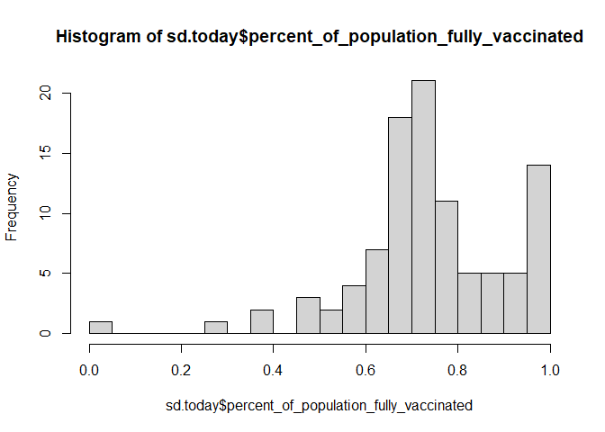

Class17 Mini Project
================
Dennis Kim

## Getting Started

We will start by downloading the most recently dated “Statewide COVID-19
Vaccines Administered by ZIP Code” CSV file from:
https://data.ca.gov/dataset/covid-19-vaccine-progress-dashboard-data-by-zip-code

``` r
# Import vaccination data
vax <- read.csv("covid19vaccinesbyzipcode_test.csv")
head(vax)
```

      as_of_date zip_code_tabulation_area local_health_jurisdiction    county
    1 2021-01-05                    95446                    Sonoma    Sonoma
    2 2021-01-05                    96014                  Siskiyou  Siskiyou
    3 2021-01-05                    96087                    Shasta    Shasta
    4 2021-01-05                    96008                    Shasta    Shasta
    5 2021-01-05                    95410                 Mendocino Mendocino
    6 2021-01-05                    95527                   Trinity   Trinity
      vaccine_equity_metric_quartile                 vem_source
    1                              2 Healthy Places Index Score
    2                              2    CDPH-Derived ZCTA Score
    3                              2    CDPH-Derived ZCTA Score
    4                             NA            No VEM Assigned
    5                              3    CDPH-Derived ZCTA Score
    6                              2    CDPH-Derived ZCTA Score
      age12_plus_population age5_plus_population tot_population
    1                4840.7                 5057           5168
    2                 135.0                  135            135
    3                 513.9                  544            544
    4                1125.3                 1164             NA
    5                 926.3                  988            997
    6                 476.6                  485            499
      persons_fully_vaccinated persons_partially_vaccinated
    1                       NA                           NA
    2                       NA                           NA
    3                       NA                           NA
    4                       NA                           NA
    5                       NA                           NA
    6                       NA                           NA
      percent_of_population_fully_vaccinated
    1                                     NA
    2                                     NA
    3                                     NA
    4                                     NA
    5                                     NA
    6                                     NA
      percent_of_population_partially_vaccinated
    1                                         NA
    2                                         NA
    3                                         NA
    4                                         NA
    5                                         NA
    6                                         NA
      percent_of_population_with_1_plus_dose booster_recip_count
    1                                     NA                  NA
    2                                     NA                  NA
    3                                     NA                  NA
    4                                     NA                  NA
    5                                     NA                  NA
    6                                     NA                  NA
      bivalent_dose_recip_count eligible_recipient_count
    1                        NA                        0
    2                        NA                        0
    3                        NA                        2
    4                        NA                        2
    5                        NA                        0
    6                        NA                        0
                                                                   redacted
    1 Information redacted in accordance with CA state privacy requirements
    2 Information redacted in accordance with CA state privacy requirements
    3 Information redacted in accordance with CA state privacy requirements
    4 Information redacted in accordance with CA state privacy requirements
    5 Information redacted in accordance with CA state privacy requirements
    6 Information redacted in accordance with CA state privacy requirements

> Q1. What column details the total number of people fully vaccinated?

The column labeled persons fully vaccinated

> Q2. What column details the Zip code tabulation area?

The column zip code tabulation area

> Q3. What is the earliest date in this dataset?

``` r
head(sort(vax$as_of_date))
```

    [1] "2021-01-05" "2021-01-05" "2021-01-05" "2021-01-05" "2021-01-05"
    [6] "2021-01-05"

``` r
#or
vax$as_of_date[1]
```

    [1] "2021-01-05"

The earliest date in this dataset is 1/5/2021

> Q4. What is the latest date in this dataset?

``` r
head(sort(vax$as_of_date, decreasing=TRUE))
```

    [1] "2023-02-28" "2023-02-28" "2023-02-28" "2023-02-28" "2023-02-28"
    [6] "2023-02-28"

``` r
#or
vax$as_of_date[nrow(vax)]
```

    [1] "2023-02-28"

The latest date in this dataset is 2/28/2023

We can use the skim() function for a quick overview of a new dataset
like this

``` r
skimr::skim(vax)
```

|                                                  |        |
|:-------------------------------------------------|:-------|
| Name                                             | vax    |
| Number of rows                                   | 199332 |
| Number of columns                                | 18     |
| \_\_\_\_\_\_\_\_\_\_\_\_\_\_\_\_\_\_\_\_\_\_\_   |        |
| Column type frequency:                           |        |
| character                                        | 5      |
| numeric                                          | 13     |
| \_\_\_\_\_\_\_\_\_\_\_\_\_\_\_\_\_\_\_\_\_\_\_\_ |        |
| Group variables                                  | None   |

Data summary

**Variable type: character**

| skim_variable             | n_missing | complete_rate | min | max | empty | n_unique | whitespace |
|:--------------------------|----------:|--------------:|----:|----:|------:|---------:|-----------:|
| as_of_date                |         0 |             1 |  10 |  10 |     0 |      113 |          0 |
| local_health_jurisdiction |         0 |             1 |   0 |  15 |   565 |       62 |          0 |
| county                    |         0 |             1 |   0 |  15 |   565 |       59 |          0 |
| vem_source                |         0 |             1 |  15 |  26 |     0 |        3 |          0 |
| redacted                  |         0 |             1 |   2 |  69 |     0 |        2 |          0 |

**Variable type: numeric**

| skim_variable                              | n_missing | complete_rate |     mean |       sd |    p0 |      p25 |      p50 |      p75 |     p100 | hist  |
|:-------------------------------------------|----------:|--------------:|---------:|---------:|------:|---------:|---------:|---------:|---------:|:------|
| zip_code_tabulation_area                   |         0 |          1.00 | 93665.11 |  1817.38 | 90001 | 92257.75 | 93658.50 | 95380.50 |  97635.0 | ▃▅▅▇▁ |
| vaccine_equity_metric_quartile             |      9831 |          0.95 |     2.44 |     1.11 |     1 |     1.00 |     2.00 |     3.00 |      4.0 | ▇▇▁▇▇ |
| age12_plus_population                      |         0 |          1.00 | 18895.04 | 18993.87 |     0 |  1346.95 | 13685.10 | 31756.12 |  88556.7 | ▇▃▂▁▁ |
| age5_plus_population                       |         0 |          1.00 | 20875.24 | 21105.97 |     0 |  1460.50 | 15364.00 | 34877.00 | 101902.0 | ▇▃▂▁▁ |
| tot_population                             |      9718 |          0.95 | 23372.77 | 22628.51 |    12 |  2126.00 | 18714.00 | 38168.00 | 111165.0 | ▇▅▂▁▁ |
| persons_fully_vaccinated                   |     16525 |          0.92 | 13962.33 | 15054.09 |    11 |   930.00 |  8566.00 | 23302.00 |  87566.0 | ▇▃▁▁▁ |
| persons_partially_vaccinated               |     16525 |          0.92 |  1701.64 |  2030.18 |    11 |   165.00 |  1196.00 |  2535.00 |  39913.0 | ▇▁▁▁▁ |
| percent_of_population_fully_vaccinated     |     20825 |          0.90 |     0.57 |     0.25 |     0 |     0.42 |     0.60 |     0.74 |      1.0 | ▂▃▆▇▃ |
| percent_of_population_partially_vaccinated |     20825 |          0.90 |     0.08 |     0.09 |     0 |     0.05 |     0.06 |     0.08 |      1.0 | ▇▁▁▁▁ |
| percent_of_population_with_1\_plus_dose    |     21859 |          0.89 |     0.63 |     0.24 |     0 |     0.49 |     0.67 |     0.81 |      1.0 | ▂▂▅▇▆ |
| booster_recip_count                        |     72872 |          0.63 |  5837.31 |  7165.81 |    11 |   297.00 |  2748.00 |  9438.25 |  59553.0 | ▇▂▁▁▁ |
| bivalent_dose_recip_count                  |    158664 |          0.20 |  2924.93 |  3583.45 |    11 |   190.00 |  1418.00 |  4626.25 |  27458.0 | ▇▂▁▁▁ |
| eligible_recipient_count                   |         0 |          1.00 | 12801.84 | 14908.33 |     0 |   504.00 |  6338.00 | 21973.00 |  87234.0 | ▇▃▁▁▁ |

> Q5. How many numeric columns are in this dataset?

There are 13 numeric columns

> Q6. Note that there are “missing values” in the dataset. How many NA
> values there in the persons_fully_vaccinated column?

``` r
sum(is.na(vax$persons_fully_vaccinated))
```

    [1] 16525

There are 16,525 NA values in the persons fully vaccinated column

> Q7. What percent of persons_fully_vaccinated values are missing (to 2
> significant figures)?

``` r
round(((sum(is.na(vax$persons_fully_vaccinated))/nrow(vax))*100), 2)
```

    [1] 8.29

8.29% of the persons_fully_vaccinated values are missing

> Q8. \[Optional\]: Why might this data be missing?

Large parts of zip codes are federal land that do not report their data

## Working With Dates

One of the “character” columns of the data is as_of_date, which contains
dates in the Year-Month-Day format.

Dates and times can be annoying to work with at the best of times.
However, in R we have the excellent lubridate package, which can make
life allot easier. Here is a quick example to get started.

``` r
library(lubridate)
```


    Attaching package: 'lubridate'

    The following objects are masked from 'package:base':

        date, intersect, setdiff, union

What is today’s date (at the time I am writing this)

``` r
today()
```

    [1] "2023-03-16"

The as_of_date column of our data is currently not that usable. For
example we can’t easily do math with it like answering the simple
question how many days have passed since data was first recorded.

``` r
# This will give an Error!
# today() - vax$as_of_date[1]
```

However if we convert our date data into a lubridate format things like
this will be much easier as well as plotting time series data later on.

``` r
# Specify that we are using the year-month-day format
vax$as_of_date <- ymd(vax$as_of_date)
```

Math with dates, how many days old am I?

``` r
today() - ymd("2001-11-21")
```

    Time difference of 7785 days

Now we can do math with dates. For example: How many days have passed
since the first vaccination reported in this dataset?

``` r
today() - vax$as_of_date[1]
```

    Time difference of 800 days

Using the last and the first date value we can now determine how many
days the dataset span.

``` r
vax$as_of_date[nrow(vax)] - vax$as_of_date[1]
```

    Time difference of 784 days

> Q9. How many days have passed since the last update of the dataset?

``` r
today() - vax$as_of_date[nrow(vax)]
```

    Time difference of 16 days

7 days have passed

> Q10. How many unique dates are in the dataset (i.e. how many different
> dates are detailed)?

``` r
length(unique(vax$as_of_date))
```

    [1] 113

113 unique dates

alternate approaches

``` r
library(dplyr)
```


    Attaching package: 'dplyr'

    The following objects are masked from 'package:stats':

        filter, lag

    The following objects are masked from 'package:base':

        intersect, setdiff, setequal, union

``` r
n_distinct(vax$as_of_date)
```

    [1] 113

## Working with ZIP codes

ZIP codes are also rather annoying things to work with as they are
numeric but not in the conventional sense of doing math. One of the
numeric columns in the dataset (namely vax\$zip_code_tabulation_area)
are actually ZIP codes - a postal code used by the United States Postal
Service (USPS). In R we can use the zipcodeR package to make working
with these codes easier. For example, let’s install and then load up
this package and to find the centroid of the La Jolla 92037 (i.e. UC San
Diego) ZIP code area.

``` r
library(zipcodeR)
```

``` r
geocode_zip('92037')
```

    # A tibble: 1 × 3
      zipcode   lat   lng
      <chr>   <dbl> <dbl>
    1 92037    32.8 -117.

Calculate the distance between the centroids of any two ZIP codes in
miles, e.g.

``` r
zip_distance('92037','92703')
```

      zipcode_a zipcode_b distance
    1     92037     92703     77.3

More usefully, we can pull census data about ZIP code areas (including
median household income etc.). For example:

``` r
reverse_zipcode(c('92037', "92703") )
```

    # A tibble: 2 × 24
      zipcode zipcode_…¹ major…² post_…³ common_c…⁴ county state   lat   lng timez…⁵
      <chr>   <chr>      <chr>   <chr>       <blob> <chr>  <chr> <dbl> <dbl> <chr>  
    1 92037   Standard   La Jol… La Jol… <raw 20 B> San D… CA     32.8 -117. Pacific
    2 92703   Standard   Santa … Santa … <raw 21 B> Orang… CA     33.8 -118. Pacific
    # … with 14 more variables: radius_in_miles <dbl>, area_code_list <blob>,
    #   population <int>, population_density <dbl>, land_area_in_sqmi <dbl>,
    #   water_area_in_sqmi <dbl>, housing_units <int>,
    #   occupied_housing_units <int>, median_home_value <int>,
    #   median_household_income <int>, bounds_west <dbl>, bounds_east <dbl>,
    #   bounds_north <dbl>, bounds_south <dbl>, and abbreviated variable names
    #   ¹​zipcode_type, ²​major_city, ³​post_office_city, ⁴​common_city_list, …

Optional: We can use this reverse_zipcode() to pull census data later on
for any or all ZIP code areas we might be interested in.

``` r
# Pull data for all ZIP codes in the dataset
#zipdata <- reverse_zipcode( vax$zip_code_tabulation_area )
```

# Focus on the San Diego area

Let’s now focus in on the San Diego County area by restricting ourselves
first to vax\$county == “San Diego” entries. We have two main choices on
how to do this. The first using base R the second using the dplyr
package:

``` r
# Subset to San Diego county only areas
sd <- vax[ vax$county == "San Diego", ]
```

Using dplyr the code would look like this:

``` r
library(dplyr)

sd <- filter(vax, county == "San Diego")

nrow(sd)
```

    [1] 12091

Using dplyr is often more convenient when we are subsetting across
multiple criteria - for example all San Diego county areas with a
population of over 10,000.

``` r
sd.10 <- filter(vax, county == "San Diego" &
                age5_plus_population > 10000)
nrow(sd.10)
```

    [1] 8588

``` r
nrow(sd.10)
```

    [1] 8588

``` r
n_distinct(sd.10$zip_code_tabulation_area)
```

    [1] 76

> Q11. How many distinct zip codes are listed for San Diego County?

``` r
length(unique(sd$zip_code_tabulation_area))
```

    [1] 107

There are 107 distinct zip codes for San Diego

> Q12. What San Diego County Zip code area has the largest 12 +
> Population in this dataset?

``` r
sd$zip_code_tabulation_area[which.max(sd$age12_plus_population)]
```

    [1] 92154

92154 has the largest 12+ population in this data set

> Q13. What is the overall average “Percent of Population Fully
> Vaccinated” value for all San Diego “County” as of the most recent
> date “2023-2-28”?

``` r
vax$as_of_date[nrow(vax)]
```

    [1] "2023-02-28"

``` r
# using dplyr
sd.today <- filter(sd, as_of_date == "2023-02-28")
```

``` r
mean(sd.today$percent_of_population_fully_vaccinated, na.rm=TRUE)
```

    [1] 0.7400878

74% are fully vaccinated

> Q14. Using either ggplot or base R graphics make a summary figure that
> shows the distribution of Percent of Population Fully Vaccinated
> values as of “2022-11-15”?

``` r
hist(sd.today$percent_of_population_fully_vaccinated, breaks=20)
```



``` r
library(ggplot2)
ggplot(sd.today) + 
  aes(x=percent_of_population_fully_vaccinated) + 
  geom_histogram() + 
  labs (title = "Vaccination Rate Across San Diego as of Last Week",
          x = "Percent of Population Fully Vaxed",
          y = "Count (ZIP code area)")
```

    `stat_bin()` using `bins = 30`. Pick better value with `binwidth`.

    Warning: Removed 8 rows containing non-finite values (`stat_bin()`).


# Focus on UCSD/La Jolla

UC San Diego resides in the 92037 ZIP code area and is listed with an
age 5+ population size of 36,144.

``` r
ucsd <- filter(sd, zip_code_tabulation_area=="92037")
ucsd[1,]$age5_plus_population
```

    [1] 36144

> Q15. Using ggplot make a graph of the vaccination rate time course for
> the 92037 ZIP code area:

``` r
ucsdplot <- ggplot(ucsd) +
  aes(x = as_of_date,
      y = percent_of_population_fully_vaccinated) +
  geom_point() +
  geom_line(group=1) +
  ylim(c(0,1)) +
  labs(title = "Vaccination Rate for La Jolla 92109", x= "Date", y="Percent Vaccinated")
ucsdplot
```


# Comparing to similar sized areas

``` r
# Subset to all CA areas with a population as large as 92037
vax.36 <- filter(vax, age5_plus_population > 36144 &
                as_of_date == "2023-02-28")
meanline <- mean(vax.36$percent_of_population_fully_vaccinated)
meanline
```

    [1] 0.7213331

``` r
#head(vax.36)
```

> Q16. Calculate the mean “Percent of Population Fully Vaccinated” for
> ZIP code areas with a population as large as 92037 (La Jolla)
> as_of_date “2022-11-15”. Add this as a straight horizontal line to
> your plot from above with the geom_hline() function?

``` r
ucsdplot +
  geom_hline(yintercept=meanline, col="red", lty=2)
```


> Q17. What is the 6 number summary (Min, 1st Qu., Median, Mean, 3rd
> Qu., and Max) of the “Percent of Population Fully Vaccinated” values
> for ZIP code areas with a population as large as 92037 (La Jolla)
> as_of_date “2023-02-28”?

``` r
summary(vax.36$percent_of_population_fully_vaccinated)
```

       Min. 1st Qu.  Median    Mean 3rd Qu.    Max. 
     0.3804  0.6457  0.7181  0.7213  0.7907  1.0000 

> Q18. Using ggplot generate a histogram of this data.

``` r
ggplot(vax.36) + aes(x=percent_of_population_fully_vaccinated) + geom_histogram() + labs(x= "Percent Vaccinated", y="Count") + xlim(0,1)
```

    `stat_bin()` using `bins = 30`. Pick better value with `binwidth`.

    Warning: Removed 2 rows containing missing values (`geom_bar()`).


> Q19. Is the 92109 and 92040 ZIP code areas above or below the average
> value you calculated for all these above?

``` r
vax %>% filter(as_of_date == "2022-11-15") %>%  
  filter(zip_code_tabulation_area=="92040") %>%
  select(percent_of_population_fully_vaccinated)
```

      percent_of_population_fully_vaccinated
    1                               0.548849

The returned result is less than what was calculated for the average
value above.

> Q20. Finally make a time course plot of vaccination progress for all
> areas in the full dataset with a age5_plus_population \> 36144.

``` r
vax.36.all <- filter(vax, age5_plus_population > 36144)


ggplot(vax.36.all) +
  aes(as_of_date,
      percent_of_population_fully_vaccinated, 
      group=zip_code_tabulation_area) +
  geom_line(alpha=0.2, color="blue") +
  ylim(0,1) +
  labs(x="Date", y="Percent Vaccinated",
       title="Vaccination rate accross California",
       subtitle="Only areas with population above 36k are shown") +
  geom_hline(yintercept = meanline, linetype=2)
```

    Warning: Removed 183 rows containing missing values (`geom_line()`).


