Class19 Mini Project
================
Dennis Kim

# Investigating Pertussis Resurgence

## 1. Investigating pertussis cases by year

The CDC tracks cases of Pertussis in the US. We can get their data via
web-scrapping

> Q1. With the help of the R “addin” package datapasta assign the CDC
> pertussis case number data to a data frame called cdc and use ggplot
> to make a plot of cases numbers over time

Copy data from source website and use the addin to paste as a data
frame.

Can hide the message by entering `echo=FALSE` after the r in `{r}`

Generate a plot of the data using ggplot.

``` r
library(ggplot2)
baseplot <- ggplot(cdc) +
  aes(x=Year, y=Cases) +
  geom_point() +
  geom_line() +
  labs(title = "Pertussis Cases by Year (1922-2019)", subtitle = "Data from CDC", x = "Year", y = "Number of cases")
baseplot
```

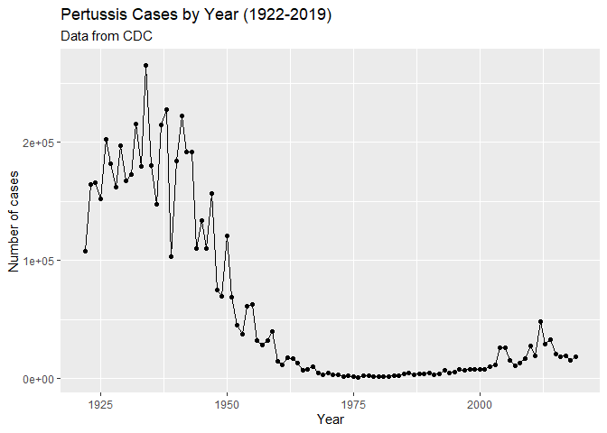

## 2. A tale of two vaccines (wP & aP)

Two types of pertussis vaccines are currently available: whole-cell
pertussis (wP) and acellular pertussis (aP). The first vaccines were
composed of ‘whole cell’ (wP) inactivated bacteria. The latter aP
vaccines use purified antigens of the bacteria (the most important
pertussis components for our immune system). These aP vaccines were
developed to have less side effects than the older wP vaccines and are
now the only form administered in the United States.

> Q2. Using the ggplot geom_vline() function add lines to your previous
> plot for the 1946 introduction of the wP vaccine and the 1996 switch
> to aP vaccine (see example in the hint below). What do you notice?

``` r
baseplot + geom_vline(xintercept=1946, col="blue", linetype=2) + geom_vline(xintercept=1996, col="red", linetype=2) 
```

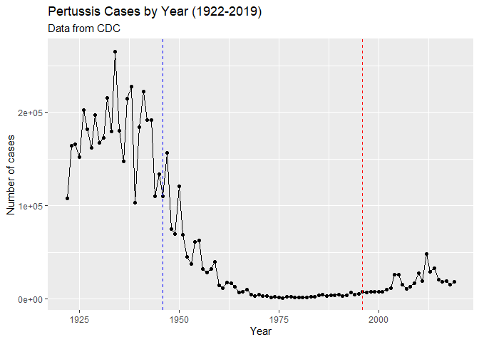

> Q3. Describe what happened after the introduction of the aP vaccine?
> Do you have a possible explanation for the observed trend?

After the introduction of the aP vaccine the number of cases remained
low for some time but began to rise and to levels not seen since prior
the introduction of the first wP vaccine.

## 3. Exploring CMI-PB data

Why is this vaccine-preventable disease on the upswing? To answer this
question we need to investigate the mechanisms underlying waning
protection against pertussis. This requires evaluation of
pertussis-specific immune responses over time in wP and aP vaccinated
individuals.

The new and ongoing CMI-PB project aims to provide the scientific
community with this information. CMI-PB tracks and makes freely
available long-term humoral and cellular immune response data for a
large number of individuals who received either DTwP or DTaP combination
vaccines in infancy followed by Tdap booster vaccinations. This includes
complete API access to longitudinal RNA-Seq, AB Titer, Olink, and live
cell assay results.

### The CMI-PB API returns JSON data

The CMI-PB API (like most APIs) sends responses in JSON format. Briefly,
JSON data is formatted as a series of key-value pairs, where a
particular word (“key”) is associated with a particular value.

``` r
# Allows us to read, write and process JSON data
library(jsonlite)
```

Let’s now read the data from the CMI-PB API.

``` r
subject <- read_json("https://www.cmi-pb.org/api/subject", simplifyVector = TRUE)
head(subject)
```

      subject_id infancy_vac biological_sex              ethnicity  race
    1          1          wP         Female Not Hispanic or Latino White
    2          2          wP         Female Not Hispanic or Latino White
    3          3          wP         Female                Unknown White
    4          4          wP           Male Not Hispanic or Latino Asian
    5          5          wP           Male Not Hispanic or Latino Asian
    6          6          wP         Female Not Hispanic or Latino White
      year_of_birth date_of_boost      dataset
    1    1986-01-01    2016-09-12 2020_dataset
    2    1968-01-01    2019-01-28 2020_dataset
    3    1983-01-01    2016-10-10 2020_dataset
    4    1988-01-01    2016-08-29 2020_dataset
    5    1991-01-01    2016-08-29 2020_dataset
    6    1988-01-01    2016-10-10 2020_dataset

> Q4. How may aP and wP infancy vaccinated subjects are in the dataset?

``` r
table(subject$infancy_vac)
```


    aP wP 
    47 49 

There are 47 aP and 49 wP vaccinated subjects.

> Q5. How many Male and Female subjects/patients are in the dataset?

``` r
table(subject$biological_sex)
```


    Female   Male 
        66     30 

There are 66 female and 30 male patients in this dataset.

> Q6. What is the breakdown of race and biological sex (e.g. number of
> Asian females, White males etc…)?

``` r
table(subject$biological_sex, subject$race)
```

            
             American Indian/Alaska Native Asian Black or African American
      Female                             0    18                         2
      Male                               1     9                         0
            
             More Than One Race Native Hawaiian or Other Pacific Islander
      Female                  8                                         1
      Male                    2                                         1
            
             Unknown or Not Reported White
      Female                      10    27
      Male                         4    13

We will be working with dates, so load the correct package.

``` r
library(lubridate)
```


    Attaching package: 'lubridate'

    The following objects are masked from 'package:base':

        date, intersect, setdiff, union

``` r
#test
today()
```

    [1] "2023-03-16"

``` r
#how many days have passied since the new year 2000
time_length(today() - ymd("2000-01-01"), "years")
```

    [1] 23.20329

> Q7. Using this approach determine (i) the average age of wP
> individuals, (ii) the average age of aP individuals; and (iii) are
> they significantly different?

``` r
age_days <- today() - ymd(subject$year_of_birth)
age_years <- time_length(age_days, "years")
head(age_years)
```

    [1] 37.20192 55.20329 40.20260 35.20329 32.20260 35.20329

``` r
subject$age <- age_years
```

``` r
library(dplyr)
```


    Attaching package: 'dplyr'

    The following objects are masked from 'package:stats':

        filter, lag

    The following objects are masked from 'package:base':

        intersect, setdiff, setequal, union

``` r
ap <- subject %>% filter(infancy_vac == "aP")
summary( ap$age )
```

       Min. 1st Qu.  Median    Mean 3rd Qu.    Max. 
      23.20   25.20   26.20   25.52   26.20   27.20 

Mean age of aP individuals are 25.52.

``` r
wp <- subject %>% filter(infancy_vac == "wP")
summary( wp$age )
```

       Min. 1st Qu.  Median    Mean 3rd Qu.    Max. 
      28.20   32.20   35.20   36.37   40.20   55.20 

Mean age of wP individuals are 36.36.

T-test

``` r
ap.age <- filter(subject, infancy_vac == "aP")$age
wp.age <- filter(subject, infancy_vac == "wP")$age

mean(ap.age)
```

    [1] 25.52108

``` r
mean(wp.age)
```

    [1] 36.36553

``` r
t.test(ap.age, wp.age)
```


        Welch Two Sample t-test

    data:  ap.age and wp.age
    t = -12.092, df = 51.082, p-value < 2.2e-16
    alternative hypothesis: true difference in means is not equal to 0
    95 percent confidence interval:
     -12.644857  -9.044045
    sample estimates:
    mean of x mean of y 
     25.52108  36.36553 

The t-test returns that the age difference is significant

> Q8. Determine the age of all individuals at time of boost?

``` r
int <- ymd(subject$date_of_boost) - ymd(subject$year_of_birth)
age_at_boost <- time_length(int, "year")
head(age_at_boost)
```

    [1] 30.69678 51.07461 33.77413 28.65982 25.65914 28.77481

> Q9. With the help of a faceted boxplot (see below), do you think these
> two groups are significantly different?

``` r
ggplot(subject) +
  aes(time_length(age, "year"),
      fill=as.factor(infancy_vac)) +
  geom_histogram(show.legend=FALSE) +
  facet_wrap(vars(infancy_vac), nrow=2) 
```

    `stat_bin()` using `bins = 30`. Pick better value with `binwidth`.

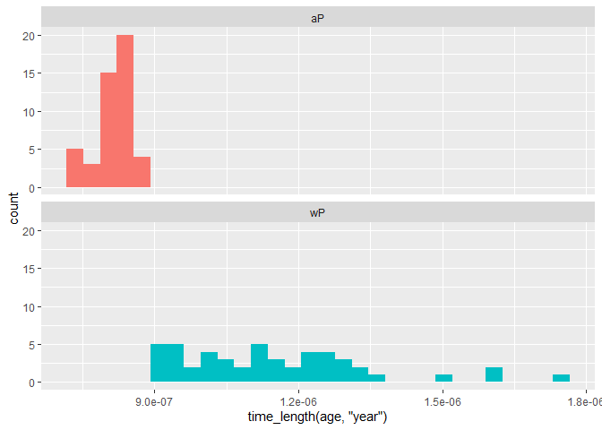

We will now be joining multiple tables together

Read the specimen and ab_titer tables into R and store the data as
specimen and titer named data frames.

``` r
specimen <- read_json("https://www.cmi-pb.org/api/specimen", simplifyVector = TRUE) 
titer <- read_json("https://www.cmi-pb.org/api/ab_titer", simplifyVector = TRUE) 
```

To know whether a given specimen_id comes from an aP or wP individual we
need to link (a.k.a. “join” or merge) our specimen and subject data
frames. The excellent dplyr package (that we have used previously) has a
family of join() functions that can help us with this common task:

> Q9. Complete the code to join specimen and subject tables to make a
> new merged data frame containing all specimen records along with their
> associated subject details:

``` r
meta <- inner_join(specimen, subject)
```

    Joining with `by = join_by(subject_id)`

``` r
dim(meta)
```

    [1] 729  14

> Q10. Now using the same procedure join meta with titer data so we can
> further analyze this data in terms of time of visit aP/wP, male/female
> etc.

``` r
abdata <- inner_join(titer, meta)
```

    Joining with `by = join_by(specimen_id)`

``` r
dim(abdata)
```

    [1] 32675    21

> Q11. How many specimens (i.e. entries in abdata) do we have for each
> isotype?

Pull up the table

``` r
table(abdata$isotype)
```


     IgE  IgG IgG1 IgG2 IgG3 IgG4 
    6698 1413 6141 6141 6141 6141 

> Q12. What do you notice about the number of visit 8 specimens compared
> to other visits?

``` r
table(abdata$visit)
```


       1    2    3    4    5    6    7    8 
    5795 4640 4640 4640 4640 4320 3920   80 

Visit 8 is still ongoing

## 4. Examine IgG1 Ab titer values

Now using our joined/merged/linked abdata dataset filter() for IgG1
isotype and exclude the small number of visit 8 entries.

``` r
ig1 <- abdata %>% filter(isotype == "IgG1", visit!=8)
head(ig1)
```

      specimen_id isotype is_antigen_specific antigen        MFI MFI_normalised
    1           1    IgG1                TRUE     ACT 274.355068      0.6928058
    2           1    IgG1                TRUE     LOS  10.974026      2.1645083
    3           1    IgG1                TRUE   FELD1   1.448796      0.8080941
    4           1    IgG1                TRUE   BETV1   0.100000      1.0000000
    5           1    IgG1                TRUE   LOLP1   0.100000      1.0000000
    6           1    IgG1                TRUE Measles  36.277417      1.6638332
       unit lower_limit_of_detection subject_id actual_day_relative_to_boost
    1 IU/ML                 3.848750          1                           -3
    2 IU/ML                 4.357917          1                           -3
    3 IU/ML                 2.699944          1                           -3
    4 IU/ML                 1.734784          1                           -3
    5 IU/ML                 2.550606          1                           -3
    6 IU/ML                 4.438966          1                           -3
      planned_day_relative_to_boost specimen_type visit infancy_vac biological_sex
    1                             0         Blood     1          wP         Female
    2                             0         Blood     1          wP         Female
    3                             0         Blood     1          wP         Female
    4                             0         Blood     1          wP         Female
    5                             0         Blood     1          wP         Female
    6                             0         Blood     1          wP         Female
                   ethnicity  race year_of_birth date_of_boost      dataset
    1 Not Hispanic or Latino White    1986-01-01    2016-09-12 2020_dataset
    2 Not Hispanic or Latino White    1986-01-01    2016-09-12 2020_dataset
    3 Not Hispanic or Latino White    1986-01-01    2016-09-12 2020_dataset
    4 Not Hispanic or Latino White    1986-01-01    2016-09-12 2020_dataset
    5 Not Hispanic or Latino White    1986-01-01    2016-09-12 2020_dataset
    6 Not Hispanic or Latino White    1986-01-01    2016-09-12 2020_dataset
           age
    1 37.20192
    2 37.20192
    3 37.20192
    4 37.20192
    5 37.20192
    6 37.20192

> Q13. Complete the following code to make a summary boxplot of Ab titer
> levels for all antigens:

``` r
ggplot(ig1) +
  aes(MFI, antigen) +
  geom_boxplot() + 
  facet_wrap(vars(visit), nrow=2)
```

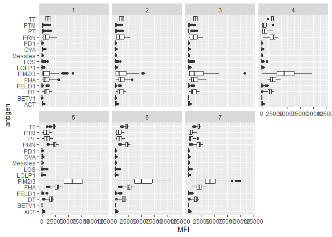

> Q14. What antigens show differences in the level of IgG1 antibody
> titers recognizing them over time? Why these and not others?

The antigens that show differences in the level of antibody titers over
time are FIM2/3, and FHA. They are the only ones that are increasing
over the duration of visits.

We can attempt to examine differences between wP and aP here by setting
color and/or facet values of the plot to include infancy_vac status (see
below). However these plots tend to be rather busy and thus hard to
interpret easily.

``` r
ggplot(ig1) +
  aes(MFI, antigen, col=infancy_vac ) +
  geom_boxplot(show.legend = FALSE) + 
  facet_wrap(vars(visit), nrow=2) +
  theme_bw()
```

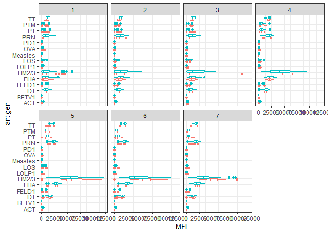

Another version of this plot adding infancy_vac to the faceting:

``` r
ggplot(ig1) +
  aes(MFI, antigen, col=infancy_vac ) +
  geom_boxplot(show.legend = FALSE) + 
  facet_wrap(vars(infancy_vac, visit), nrow=2)
```

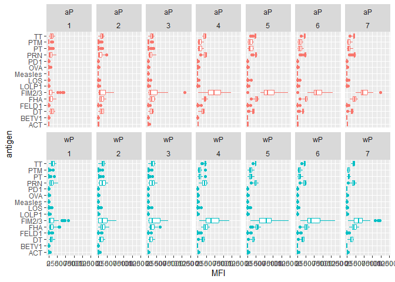

> Q15. Filter to pull out only two specific antigens for analysis and
> create a boxplot for each. You can chose any you like. Below I picked
> a “control” antigen (“Measles”, that is not in our vaccines) and a
> clear antigen of interest (“FIM2/3”, extra-cellular fimbriae proteins
> from B. pertussis that participate in substrate attachment).

``` r
filter(ig1, antigen=="Measles") %>%
  ggplot() +
  aes(MFI, col=infancy_vac) +
  geom_boxplot(show.legend = FALSE) +
  facet_wrap(vars(visit)) +
  theme_bw()
```

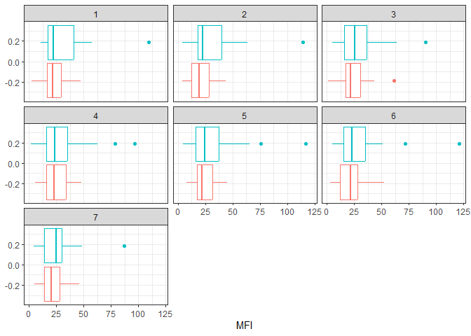

One for FIM2/3

``` r
filter(ig1, antigen=="FIM2/3") %>%
  ggplot() +
  aes(MFI, col=infancy_vac) +
  geom_boxplot(show.legend = FALSE) +
  facet_wrap(vars(visit)) +
  theme_bw()
```

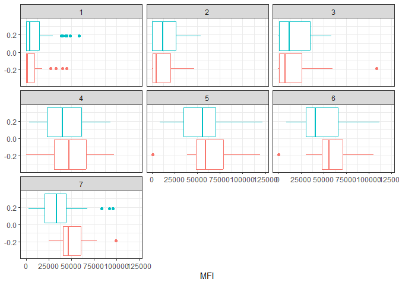

> Q16. What do you notice about these two antigens time course and the
> FIM2/3 data in particular?

FIM2/3 levels rise over time and exceed that of Measles. They also
appear to peak at visit 5 and then decline. This trend appears similar
for for wP and aP subjects.

> Q17. Do you see any clear difference in aP vs. wP responses?

aP responses are greater than wP responses in FIM2/3 antigen levels
after visit 4, but less in the visits prior to.

## 5 Obtaining CMI-PB RNASeq data

For RNA-Seq data the API query mechanism quickly hits the web browser
interface limit for file size. We will present alternative download
mechanisms for larger CMI-PB datasets in the next section. However, we
can still do “targeted” RNA-Seq querys via the web accessible API.

The link is for the key gene involved in expressing any IgG1 antibody,
namely the IGHG1 gene. Let’s read available RNA-Seq data for this gene
into R and investigate the time course of it’s gene expression values.

``` r
url <- "https://www.cmi-pb.org/api/v2/rnaseq?versioned_ensembl_gene_id=eq.ENSG00000211896.7"

rna <- read_json(url, simplifyVector = TRUE) 
```

To facilitate further analysis we need to “join” the rna expression data
with our metadata meta, which is itself a join of sample and specimen
data. This will allow us to look at this genes TPM expression values
over aP/wP status and at different visits (i.e. times):

``` r
#meta <- inner_join(specimen, subject)
ssrna <- inner_join(rna, meta)
```

    Joining with `by = join_by(specimen_id)`

> Q18. Make a plot of the time course of gene expression for IGHG1 gene
> (i.e. a plot of visit vs. tpm).

``` r
ggplot(ssrna) +
  aes(visit, tpm, group=subject_id) +
  geom_point() +
  geom_line(alpha=0.2)
```

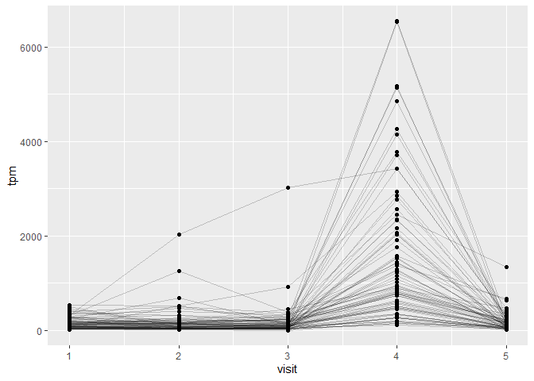

> Q19.: What do you notice about the expression of this gene (i.e. when
> is it at it’s maximum level)?

The expression of the gene is at the max level at visit 4

> Q20. Does this pattern in time match the trend of antibody titer data?
> If not, why not?

The trend does not match as the antibodies made in the cells are long
lived but the expression cuts off short.

We can dig deeper and color and/or facet by infancy_vac status:

``` r
ggplot(ssrna) +
  aes(tpm, col=infancy_vac) +
  geom_boxplot() +
  facet_wrap(vars(visit))
```

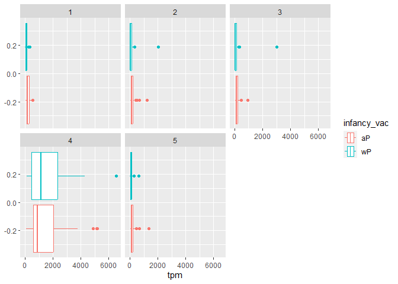

There is no obvious wP vs. aP differences here even if we focus in on a
particular visit:

``` r
ssrna %>%  
  filter(visit==4) %>% 
  ggplot() +
    aes(tpm, col=infancy_vac) + geom_density() + 
    geom_rug() 
```

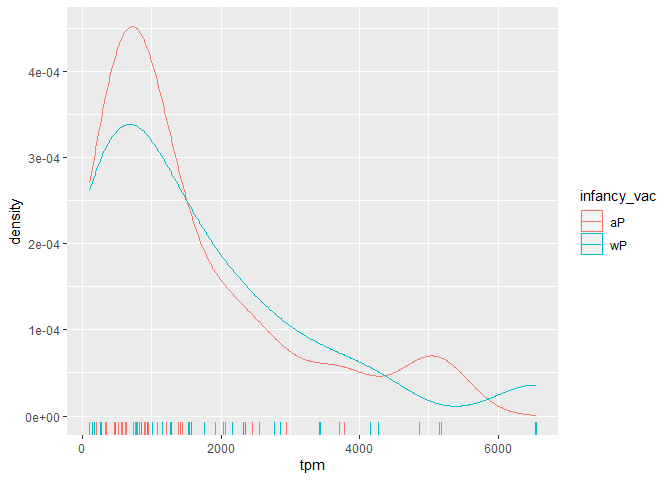
